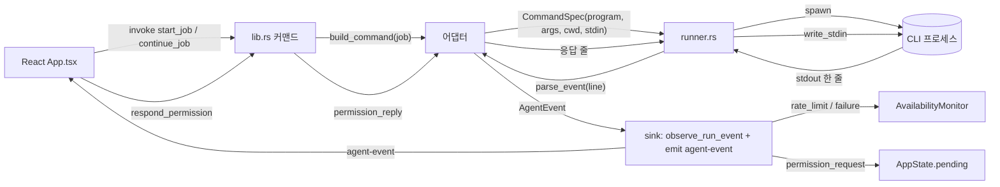
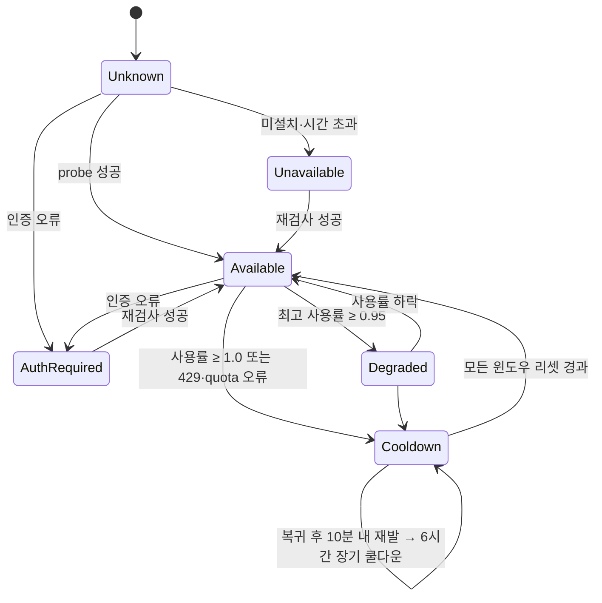
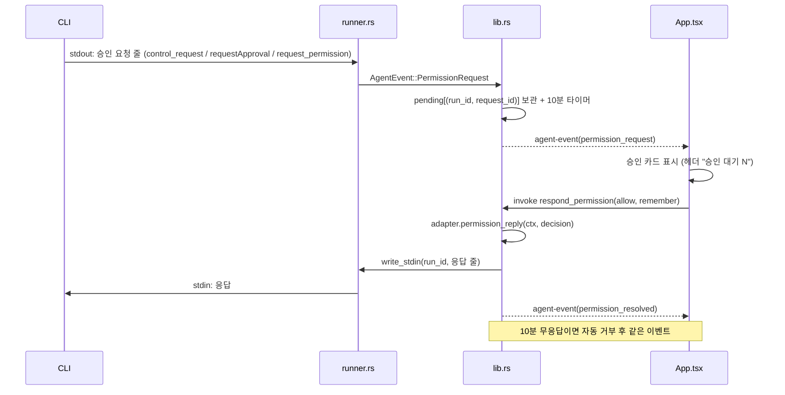

# Agent Dock

> PC에 설치·로그인된 여러 AI 코딩 CLI(Codex, Claude Code, Antigravity, Gemini CLI, OpenCode)를 **한 창에서 실행**하고, 각 CLI의 **가용성(한도·로그인)**, **우선순위**, **승인 요청**을 함께 관리하는 로컬 Tauri 앱입니다.
> 앱은 토큰을 저장하거나 복사하지 않고, 각 CLI가 이미 갖고 있는 로그인 상태를 그대로 씁니다.

- 저장소 요약·다음 작업: [`HANDOFF.md`](HANDOFF.md)
- 개발 환경: Windows 11, Rust 1.98, Node 22, Tauri 2 (2026-09 기준)
- 이 문서는 "어떻게 만들었고 무엇을 배웠는지"를 공유하기 위한 학습용 기록을 겸합니다.

---

## 목차

1. [왜 만들었나](#1-왜-만들었나)
2. [핵심 기능](#2-핵심-기능)
3. [화면 구성](#3-화면-구성)
4. [빠른 시작 (다른 컴퓨터에서 실행)](#4-빠른-시작-다른-컴퓨터에서-실행)
5. [아키텍처](#5-아키텍처)
6. [CLI별 프로토콜 실측 노트](#6-cli별-프로토콜-실측-노트)
7. [Windows에서 배운 것들 (함정 모음)](#7-windows에서-배운-것들-함정-모음)
8. [빌드·실행·테스트](#8-빌드실행테스트)
9. [개발 방식](#9-개발-방식)
10. [로드맵과 미구현](#10-로드맵과-미구현)
11. [참고 자료](#11-참고-자료)

---

## 1. 왜 만들었나

AI 코딩 구독을 여러 개 쓰다 보면 실제 병목은 모델 성능이 아니라 **한도**입니다. Claude는 5시간·7일 윈도우, Codex는 5시간·주간 윈도우, Google AI Pro(Antigravity)는 5시간 창 + 주간 상한이 있고, 하나가 막히면 다른 CLI로 넘어가야 합니다. 그런데 CLI마다 세션·도구·이벤트 형식이 달라서 "지금 뭐가 쓸 수 있는지", "어디까지 얘기했는지"를 사람이 기억해야 했습니다.

Agent Dock은 그 기억을 대신합니다.

- 어떤 CLI가 **지금 쓸 수 있는지**(로그인·한도·쿨다운)를 한 줄로 보여 주고,
- 대화 중에 CLI를 **바꿔도 문맥을 이어** 주며(handoff 요약 자동 첨부),
- CLI가 던지는 **도구 승인 요청을 앱 화면에서** 바로 답하게 합니다.

무거운 워크스페이스가 아니라, 필요할 때만 CLI 프로세스를 띄우는 가벼운 런처·세션 관리자를 목표로 했습니다.

## 2. 핵심 기능

| 기능 | 동작 | 관련 코드 |
|---|---|---|
| **채팅 UI + CLI별 세션** | 대화마다 CLI별 세션 id를 따로 기억한다(`sessions[cli] = {sessionId, syncedUpTo}`). 같은 CLI로 이어 보내면 그 CLI의 재개 명령(`--resume`, `thread/resume`, `session/load` 등)을 쓴다 | `src/App.tsx` |
| **대화 중 CLI 전환 (handoff)** | 툴바에서 CLI를 바꾸면 새 CLI가 모르는 항목(다른 CLI에서 오간 사용자·응답·파일 변경)만 골라 요약 문단으로 앞에 붙인다. 16,000자 초과분은 앞부분을 생략 | `buildHandoff` in `App.tsx` |
| **가용성 모니터** | 시작 시 전체 probe, 이후 5분 주기 + 창 포커스 복귀 시 재검사. 공식 사용률(Claude 스트림, Codex app-server)과 실패 문구(429·"exhausted daily quota"·인증 오류)를 상태 머신에 반영 | `availability.rs`, `lib.rs` |
| **드래그 우선순위** | 상단 카드를 끌어 순서를 바꾸면 라우팅 체인·상태바 순서·추천 CLI가 함께 바뀌고 localStorage에 저장 | `set_routing_chain`, `scheduler.rs` |
| **승인 실시간 중계** | Claude(stdio permission prompt), Codex(app-server requestApproval), Gemini(ACP request_permission)가 보내는 도구 승인 요청을 대화 안 카드로 띄우고 허용/세션 동안 허용/거부를 CLI로 돌려준다. 10분 무응답 시 자동 거부 | `respond_permission`, 각 어댑터 `permission_reply` |
| **CLI 레지스트리 패널** | CLI별 사용 여부(끄면 상태바·라우팅·probe에서 제외), 순위, 상태, 로그인 계정, 버전, 로그인 버튼, 모델 선택을 한 표에서 관리 | `App.tsx` 레지스트리 모달 |
| **앱 안에서 로그인** | 각 CLI의 자체 로그인 명령을 새 콘솔 창으로 띄우고, 창이 열린 동안 8초마다 재검사해 로그인되면 바로 초록으로 | `login_cli` in `lib.rs` |
| **모델 선택** | CLI가 제공하는 목록(Codex `model/list`, Gemini/OpenCode ACP·명령, Antigravity `agy models`, Claude는 바이너리 스캔)에서 고르고 실행 인자로 전달 | `model_listing` / `parse_models` |
| **스냅샷 보존** | 가용성이 바뀔 때마다 `%APPDATA%\com.user.agent-dock\availability.json`에 저장하고 재시작 시 복원(지난 리셋 창은 폐기, 진행 중 쿨다운 유지) | `lib.rs` store |
| **여러 줄 프롬프트** | CLI마다 안전한 전달 경로를 골라 줄바꿈이 있는 긴 프롬프트도 그대로 간다(§7) | 각 어댑터 `build_command` |

## 3. 화면 구성

```
┌ 상단 카드: ① Claude Ready  ② Codex Ready  ③ Antigravity Ready  ④ Gemini Cooldown  ⑤ OpenCode Ready   [승인 대기 1] [⚙ CLI 설정]
├ 왼쪽: 대화 목록 (+ 새 대화)          │ 오른쪽: 대화 본문
│   [claude] Use the Bash tool…  실행 중 │   사용자 말풍선 / 응답(스트리밍) / 도구 호출 줄 / 승인 카드 / 시스템 줄
│                                        │   ┌ 승인 요청 · Bash  Print 5*5 with Python ─────┐
│                                        │   │ $ python -c "print(5*5)"   ▸ 입력 전체      │
│                                        │   │ [허용] [세션 동안 허용] [거부]              │
│                                        │   └─────────────────────────────────────────────┘
├ 툴바: [📁 D:\dev] [CLI ▾] [모델 ▾] [↻] [☐ 파일 쓰기 허용]  추천: Claude        [중지] [자동 전환: 켬]
└ 상태바: ● Claude Ready 17% 01:40↻ 공식 · ● Codex Ready 55% 11:39↻ 공식 · ● Antigravity Ready ? 23:03 재검사 CLI 제시 · …
```

- 카드 색: 초록 = 사용 가능, 노랑 = 임박(사용률 95% 이상), 주황 = 쿨다운, 빨강 = 로그인 필요/사용 불가, 회색 = 미확인.
- 상태바 항목을 클릭하면 상세 패널(윈도우별 사용률·리셋 시각·근거·계정·버전·마지막 오류·재검사·로그인 버튼)이 열립니다.
- "파일 쓰기 허용"은 CLI별 권한 모드로 번역됩니다: Claude `acceptEdits`/`plan`, Codex 샌드박스 `workspace-write`/`read-only`, Gemini `auto_edit`/`plan`, Antigravity `accept-edits`/`plan`, OpenCode 에이전트 `build`/`plan`.

## 4. 빠른 시작 (다른 컴퓨터에서 실행)

Windows 10/11 전용입니다(콘솔 로그인 창·`.cmd` 셔틀 해석·winget 경로가 Windows 기준). 비공개 저장소이므로 `gh auth login`을 소유 계정으로 먼저 합니다.

### 4-1. 개발 도구

| 도구 | 설치 | 비고 |
|---|---|---|
| Git | `winget install Git.Git` | |
| GitHub CLI | `winget install GitHub.cli` → `gh auth login` | 비공개 저장소 clone용 |
| Node.js 22 LTS | `winget install OpenJS.NodeJS.LTS` | |
| Rust | `winget install Rustlang.Rustup` → 새 창에서 `rustup default stable-msvc` | |
| VS Build Tools 2022 | `winget install Microsoft.VisualStudio.2022.BuildTools` → 설치 관리자에서 **"C++를 사용한 데스크톱 개발"** 워크로드 | MSVC 링커·Windows SDK |
| WebView2 | Windows 11 기본 포함. 없으면 "WebView2 Evergreen Runtime" | Tauri 웹뷰 |

디스크는 8 GB 이상 비워 두세요(`src-tauri\target`이 6~7 GB). C: 여유가 적으면 설치 전에 사용자 환경 변수 `RUSTUP_HOME`·`CARGO_HOME`을 다른 드라이브(예: `D:\tools\rustup`, `D:\tools\cargo`)로 두고 `CARGO_HOME\bin`을 PATH에 넣습니다(§7 참고).

### 4-2. 쓸 CLI 설치·로그인

앱은 설치되어 로그인된 CLI만 씁니다. 하나만 있어도 동작하고, 안 쓰는 CLI는 ⚙ CLI 설정에서 끌 수 있습니다.

| CLI | 설치 | 로그인 |
|---|---|---|
| Claude Code | `npm i -g @anthropic-ai/claude-code` | `claude auth login` |
| Codex | `npm i -g @openai/codex` | `codex login` |
| Antigravity (Google AI Pro) | `winget install Google.AntigravityCLI` | 터미널에서 `agy` 첫 실행 → 브라우저 로그인 |
| Gemini CLI (선택) | `npm i -g @google/gemini-cli` | `gemini` → `/auth` (개인 Google 로그인은 2026-06 종료, API 키만) |
| OpenCode (선택) | `npm i -g opencode-ai` | `opencode auth login` |

### 4-3. 받아서 실행

```powershell
gh repo clone bin7335/agent-dock
cd agent-dock
npm install
npm run tauri dev        # 첫 빌드 5~10분, 이후 src-tauri 변경 시 자동 재빌드
```

설치 파일: `npm run tauri build` → `src-tauri\target\release\bundle\` (msi·nsis).

### 4-4. 처음 켰을 때

1. 상단 카드 색을 봅니다. 빨강이면 상태바 → 상세 패널 → 로그인 버튼으로 그 CLI의 로그인 콘솔을 띄웁니다.
2. ⚙ CLI 설정에서 안 쓰는 CLI를 끄고 모델을 고릅니다.
3. 툴바에서 프로젝트 폴더를 고른 뒤 메시지를 보냅니다.

## 5. 아키텍처

### 5-1. 기술 스택

| 층 | 선택 | 이유 |
|---|---|---|
| 데스크톱 셸 | **Tauri 2** | 웹뷰 기반이라 가볍고(설치 5 MB대), Rust 백엔드에서 프로세스를 직접 다룰 수 있음 |
| 백엔드 | **Rust** + tokio(비동기 프로세스·stdin/stdout 스트림) + serde_json | CLI마다 다른 JSON 스트림을 줄 단위로 파싱하고 stdin을 열어 둔 채 양방향 통신 |
| 프론트 | **React 19 + TypeScript + Vite 7** | 단일 파일(`App.tsx`)에 대화·상태바·레지스트리·승인 카드 |
| 저장 | localStorage(우선순위·사용 여부·모델) + JSON 파일(가용성 스냅샷) | SQLite 스키마(`db.rs`)는 준비만 됨 |

### 5-2. 저장소 구조

```
agent-dock/
├─ src/                      프론트 (React)
│  ├─ App.tsx      1,009줄   대화·세션·handoff·승인 카드·상태바·레지스트리·드래그
│  ├─ types.ts       103줄   Rust 이벤트/스냅샷 타입 미러
│  └─ App.css        725줄
├─ src-tauri/src/            백엔드 (Rust)
│  ├─ lib.rs         800줄   Tauri 커맨드, 가용성 루프, probe 실행, 로그인 흐름, 승인 대기 관리
│  ├─ runner.rs      581줄   프로세스 실행·stdin 유지·후속 쓰기·중지·타임아웃, PATH 해석
│  ├─ availability.rs 833줄  CLI별 스냅샷 상태 머신, 오류 분류, 리셋/retry-after 파싱, 저장/복원
│  ├─ scheduler.rs   121줄   라우팅 체인과 후보 선택(pick_candidate)
│  ├─ models.rs       93줄   CliId·Job·CommandSpec·HandoffPacket
│  ├─ db.rs           70줄   SQLite 스키마(미배선)
│  └─ adapters/
│     ├─ mod.rs      292줄   어댑터 계약(trait)·공통 이벤트·헬퍼
│     ├─ claude.rs   623줄   stream-json + stdio permission prompt
│     ├─ codex.rs    773줄   app-server JSON-RPC
│     ├─ gemini.rs   801줄   ACP(JSON-RPC 2.0)
│     ├─ antigravity.rs 321줄  agy stream-json
│     └─ opencode.rs 357줄   run --format json
├─ HANDOFF.md                다음 세션용 요약
└─ README.md
```

### 5-3. 이벤트 파이프라인



핵심은 **어댑터가 상태를 갖지 않는다**는 점입니다. 어댑터는 "명령을 어떻게 조립하고, 한 줄을 어떤 공통 이벤트로 바꾸고, 승인 응답을 어떤 문자열로 만들지"만 압니다. 프로세스·대기 요청·타이머 같은 상태는 러너와 `lib.rs`가 갖습니다. 덕분에 CLI 하나를 추가할 때 파일 하나만 만들면 됩니다.

공통 이벤트(`AgentEvent`): `SessionStarted` · `Message{text, delta}` · `ToolUse` · `FileChange` · `RateLimit{window, utilization, resets_at}` · `Completed{ok, summary}` · `Stderr` · `ProcessExited{code, cancelled}` · `PermissionRequest{request_id, tool, description, input, can_remember, suggestions}` · `PermissionResolved`.

### 5-4. 어댑터 계약 (`adapters/mod.rs`의 `CliAdapter` trait)

| 메서드 | 역할 | 비고 |
|---|---|---|
| `probe_command` / `probe_exchange` + `interpret_probe(_lines)` | 설치·로그인 확인 | Claude `auth status`, Codex `login status`, Gemini·OpenCode·Antigravity는 각자 방식 |
| `build_command(job)` / `build_resume_command(job, session_id)` | 실행·재개 명령 조립 | 프롬프트는 `CommandSpec.stdin`으로 |
| `parse_event(line)` | stdout 한 줄 → `Vec<AgentEvent>` | 모르는 줄은 빈 벡터 |
| `keeps_stdin_open` | 실행 중 stdin을 열어 둘지 | Claude·Codex·Gemini = true |
| `stdin_follow_up(job, session_id)` → `LineReaction{send, drop_events}` | stdout 줄을 보고 stdin으로 이어 보낼 줄(Codex `turn/start`, Gemini `session/prompt`)과 이벤트 버림 여부(세션 복원 재생 구간) | 상태가 필요하면 클로저 안 Atomic |
| `permission_reply(ctx, decision)` | 승인 응답 문자열 | CLI마다 다른 형식 |
| `filter_stderr(line)` | stderr 줄 정리 | Codex tracing 로그는 ERROR·WARN만, Gemini 객체 덤프는 message 줄만 |
| `rate_limit_exchange` + `parse_rate_limits` + `parse_account` | 공식 사용량·계정 | Codex app-server |
| `login_flow` / `version_command` / `model_listing` + `parse_models` / `scan_models` | 로그인·버전·모델 목록 | |

### 5-5. 가용성 상태 머신 (`availability.rs`)



| 규칙 | 값 | 상수 |
|---|---|---|
| 임박(노랑) 임계치 | 사용률 95% | `HIGH_USAGE_THRESHOLD` |
| 주기 probe | 5분 | `PROBE_INTERVAL_SECS` |
| 추정 쿨다운(리셋 시각을 모를 때) | 30분 | `DEFAULT_COOLDOWN_SECS` |
| 재발 판정 창 / 장기 쿨다운 | 10분 / 6시간 | `RELAPSE_WINDOW_SECS`, `LONG_COOLDOWN_SECS` |
| 모니터 틱 | 30초 | `TICK_INTERVAL` |

- **근거(evidence)** 를 함께 보여 줍니다: `공식`(CLI가 준 사용률·리셋), `CLI 제시`(로그인 여부만 확인), `추정`(오류 문구로 추정).
- 오류 원문에서 `resets_at` epoch, `retry-after`/`retryDelay`/`retry in Ns`를 파싱해 정확한 복귀 시각을 씁니다(`extract_reset_epoch`, `extract_retry_after_secs`).
- Claude·Codex처럼 윈도우가 여러 개인 구독은 윈도우별로 사용률·리셋을 따로 들고, **전부 리셋된 뒤에만** 복귀합니다.

### 5-6. 라우팅과 추천

`scheduler::pick_candidate`는 라우팅 체인(상단 카드 순서) 순으로 **켜져 있고 Available**인 CLI를 고르고, 없으면 Degraded를 고릅니다. 지금은 "추천: Claude"처럼 안내만 하며, 쿨다운 시 자동 재개(2단계 자동 폴백)는 다음 작업입니다.

### 5-7. 승인 실시간 중계



CLI마다 응답 형식이 다르므로(§6) `suggestions`에 CLI가 준 선택지 원문(JSON)을 그대로 실어 두었다가 응답에 되돌려 줍니다. "세션 동안 허용" 버튼은 CLI가 그런 선택지를 제공할 때만 보입니다.

### 5-8. 대화 중 CLI 전환

프론트가 대화 항목마다 `syncedUpTo`(그 CLI가 이미 아는 항목 수)를 기억합니다. 다른 CLI로 바꿔 보내면 그 뒤의 사용자·응답·파일 변경 항목만 골라 "그사이 대화" 문단을 만들고, 새 CLI면 새 세션을, 이미 세션이 있으면 재개 명령을 씁니다. 실행이 끝날 때 `syncedUpTo`를 갱신합니다.

## 6. CLI별 프로토콜 실측 노트

모두 2026-09 초 실제 버전으로 직접 확인한 내용입니다. 공식 문서가 얇은 부분이라 학습 가치가 큽니다.

### 6-1. Claude Code 2.1.259 — stream-json + stdio permission prompt

```
claude -p --output-format stream-json --verbose --input-format stream-json \
       --permission-prompt-tool stdio --permission-mode acceptEdits|plan [--model X] [--resume ID]
```

- 프롬프트는 stdin으로 한 줄 JSON: `{"type":"user","message":{"role":"user","content":[{"type":"text","text":"…"}]}}` (여러 줄도 안전).
- stdout 이벤트: `system/init`(session_id), `assistant`(content: text·tool_use), `user`(tool_result), `rate_limit_event`(`rate_limit_info.unifiedWindows.five_hour|seven_day{utilization, resetsAt}` — **공식 사용률**), `result`.
- 승인이 필요하면 `{"type":"control_request","request_id":"…","request":{"subtype":"can_use_tool","tool_name":"Bash","input":{…},"description":"…","permission_suggestions":[…]}}`가 오고, stdin으로 `{"type":"control_response","response":{"subtype":"success","request_id":"…","response":{"behavior":"allow","updatedInput":{…},"updatedPermissions":[…]}}}` 또는 `{"behavior":"deny","message":"…"}`를 보냅니다(Claude Agent SDK와 같은 프로토콜).
- `result` 뒤에도 프로세스는 stdin이 닫힐 때까지 살아 있으므로 러너가 결과를 받으면 stdin을 닫습니다.
- 동작 메모: `acceptEdits`는 파일 편집뿐 아니라 `echo >`·`mkdir` 같은 파일시스템 Bash도 자동 승인, `plan`은 `echo` 같은 읽기 전용 명령을 묻지 않음 → 승인 카드는 python·npm·git 쓰기 같은 명령에서 뜹니다.
- 모델 목록 명령이 없어 설치된 네이티브 바이너리(`claude.exe`)를 스캔해 `claude-<계열>-<버전>` 문자열을 뽑습니다.

### 6-2. Codex 0.152.1 — `codex app-server` JSON-RPC (jsonrpc 필드 없음)

스키마는 `codex app-server generate-json-schema --out <dir>`로 뽑을 수 있습니다(616개 정의).

```
→ {"id":1,"method":"initialize","params":{"clientInfo":{"name":"agent-dock","title":"Agent Dock","version":"0.1.0"}}}
→ {"method":"initialized","params":{}}
→ {"id":2,"method":"thread/start","params":{"cwd":"D:\\dev","approvalPolicy":"on-request","sandbox":"read-only","model":"gpt-5.6-sol"}}
← {"id":2,"result":{"thread":{"id":"01a0…"},"model":"gpt-5.6-sol",…}}
→ {"id":3,"method":"turn/start","params":{"threadId":"01a0…","input":[{"type":"text","text":"…"}]}}
← {"method":"item/agentMessage/delta","params":{"delta":"I"}}                      (스트리밍)
← {"method":"item/started","params":{"item":{"type":"commandExecution","command":"…"}}}
← {"method":"thread/status/changed","params":{"status":{"type":"active","activeFlags":["waitingOnApproval"]}}}
← {"method":"item/commandExecution/requestApproval","id":0,"params":{"reason":"Allow creating x.txt?","command":"…","cwd":"…","availableDecisions":["accept",{"acceptWithExecpolicyAmendment":{…}},"cancel"]}}
→ {"id":0,"result":{"decision":"accept"}}        (accept | acceptForSession | decline | cancel)
← {"method":"account/rateLimits/updated","params":{"rateLimits":{"primary":{"usedPercent":52,"windowDurationMins":10080,"resetsAt":…}}}}
← {"method":"turn/completed","params":{"turn":{"status":"completed","error":null}}}
```

- 재개는 `thread/resume{threadId}`. stdin을 닫으면 종료 코드 0.
- 사용량·계정·모델 목록도 같은 채널: `account/rateLimits/read`, `account/read`(email·planType), `model/list{limit}`.
- 샌드박스(`read-only`/`workspace-write`)가 막은 명령을 모델이 `on-request` 정책으로 다시 요청하면 승인 요청이 옵니다. 앱은 `decline`으로 답해도 턴이 이어지는 것을 확인했습니다.
- stderr에 tracing 로그가 섞이므로 ERROR·WARN만 남깁니다.

### 6-3. Gemini CLI 0.54.4 / OpenCode 1.18.5 — ACP (Agent Client Protocol, JSON-RPC 2.0)

```
→ {"jsonrpc":"2.0","id":1,"method":"initialize","params":{"protocolVersion":1,"clientCapabilities":{"fs":{"readTextFile":false,"writeTextFile":false}}}}
→ {"jsonrpc":"2.0","id":2,"method":"session/new","params":{"cwd":"D:\\dev","mcpServers":[]}}
← {"jsonrpc":"2.0","id":2,"result":{"sessionId":"…","modes":{…},"models":{"availableModels":[…]}}}
→ {"jsonrpc":"2.0","id":3,"method":"session/prompt","params":{"sessionId":"…","prompt":[{"type":"text","text":"…"}]}}
← {"jsonrpc":"2.0","method":"session/update","params":{"update":{"sessionUpdate":"agent_message_chunk","content":{"type":"text","text":"…"}}}}
← {"jsonrpc":"2.0","method":"session/update","params":{"update":{"sessionUpdate":"tool_call","title":"Writing to x.txt","kind":"edit",…}}}
← {"jsonrpc":"2.0","id":0,"method":"session/request_permission","params":{"options":[{"optionId":"proceed_always","kind":"allow_always"},{"optionId":"proceed_once","kind":"allow_once"},{"optionId":"cancel","kind":"reject_once"}],"toolCall":{…}}}
→ {"jsonrpc":"2.0","id":0,"result":{"outcome":{"outcome":"selected","optionId":"proceed_once"}}}
← {"jsonrpc":"2.0","id":3,"result":{"stopReason":"end_turn"}}
```

- Gemini: `gemini --acp --approval-mode auto_edit|plan [-m 모델]`. 재개는 `session/load{sessionId}`인데 응답 전에 **과거 대화를 session/update로 다시 흘려보내므로** 그 구간의 이벤트를 버려야 합니다(`LineReaction.drop_events`). stdin을 닫아도 프로세스가 안 끝나 러너가 5초 뒤 정리합니다. probe도 ACP `session/new`가 성공하는지로 인증을 판별합니다("Authentication required" 오류 = 로그인 필요).
- Gemini CLI는 2026-06-18부터 개인 Google 계정(무료·AI Pro·Ultra) 로그인을 끊었습니다(`IneligibleTierError` → Antigravity로 이전). 그래서 AI Pro 구독은 Antigravity CLI로 연결합니다.
- OpenCode도 `opencode acp`로 같은 프로토콜을 말합니다(`configOptions`로 model·mode(build/plan) 선택, `usage_update`로 토큰 수, sessionCapabilities resume/fork/list). 다만 기본 설정에서는 bash 실행에 승인을 묻지 않아 지금은 `opencode run --format json`을 그대로 씁니다.

### 6-4. Antigravity CLI 1.1.26 (`agy`)

```
agy -p "<프롬프트>" --output-format stream-json --mode plan|accept-edits [--dangerously-skip-permissions] [--model X] [--conversation ID] --print-timeout 30m
```

- 이벤트: `init`(conversation_id) → `step_update`(text_delta·tool_info) → `result`(status·response·usage).
- 모델 목록은 `agy models`(탭 구분, AI Pro 기준 14종: gemini 3.x flash/pro, claude-sonnet/opus, gpt-oss). 사용량은 TUI `/usage`뿐이라 헤드리스 신호가 없어 추정 경로로 다룹니다.
- winget 설치 경로가 PATH에 안 잡히는 셸이 있어 러너가 `%LOCALAPPDATA%\Microsoft\WinGet\Links`를 예비로 찾습니다.

### 6-5. OpenCode 1.18.5 (`opencode run`)

```
opencode run --format json --dir <폴더> --agent plan|build [--auto] [-m provider/model] [--session ID] "<메시지>" [-f 임시파일]
```

- 이벤트 `text`·`step_finish`. 줄바꿈이 있는 메시지는 `.cmd` 셔틀을 못 통과하므로 임시 파일로 첨부(`-f`, 메시지 뒤에 둬야 함).
- probe는 `opencode auth list`("N credentials"), 모델은 `opencode models`.
- 약관상 Claude 구독 OAuth를 OpenCode에 연결하지 않고 자체 제공자만 씁니다.

## 7. Windows에서 배운 것들 (함정 모음)

1. **npm 전역 CLI는 `.cmd` 셔틀이다.** Rust `std::process::Command`로 `.cmd`를 실행하면 cmd.exe를 경유하고(CVE-2024-24576 대응 이스케이프), 줄바꿈이 든 인자는 거부되거나 첫 줄만 전달됩니다. 해결: PATH를 뒤져 **.exe를 우선**으로 실제 파일을 찾고, 프롬프트는 인자가 아니라 **stdin**이나 JSON 메시지로 넘깁니다.
2. **stdin을 열어 둔 채 양방향으로 쓰기.** 승인 응답을 보내려면 프롬프트를 쓴 뒤에도 stdin을 닫지 말아야 합니다. 러너는 `Arc<Mutex<Option<ChildStdin>>>` 슬롯에 stdin을 두고, 프롬프트 쓰기 동안 잠가 응답이 먼저 나가지 않게 합니다. 결과가 오면 닫고, 5초 안에 안 끝나면 죽인 뒤 정상 종료로 봅니다.
3. **thread id를 받아야 다음 요청을 보낼 수 있는 프로토콜**(Codex turn/start, Gemini session/prompt)은 "stdout 줄에 반응해 stdin으로 이어 보내는" 콜백(`stdin_follow_up`)으로 풀었습니다. 어댑터는 그대로 무상태이고 콜백 안에만 Atomic 플래그를 둡니다.
4. **콘솔 로그인 창.** `cmd /c start "" /wait <script.cmd>`로 띄우면 Windows는 배치를 `cmd /K`로 열어 키를 눌러도 창이 안 닫힙니다 → 스크립트 끝에 `exit`. 콘솔은 앱의 PATH를 물려받아 winget `agy`를 못 찾을 수 있으므로 러너가 찾은 실행 파일 경로를 `call`로 부릅니다. 창이 열린 동안 8초마다 재검사해 로그인되는 즉시 초록으로.
5. **HTML5 드래그**가 WebView2에서 동작하려면 Tauri 창 설정 `dragDropEnabled: false`가 필요합니다(파일 드롭 처리와 충돌).
6. **Rust 빌드 용량.** `target`이 6~7 GB, VS Build Tools 3 GB, Rust 툴체인 2 GB. C: 여유가 0이 되어 `RUSTUP_HOME`·`CARGO_HOME`·`TEMP`를 D:로 옮겼습니다. 새 컴퓨터에서는 처음부터 다른 드라이브를 잡는 편이 편합니다.
7. **Codex 샌드박스 헬퍼.** `codex-windows-sandbox-setup.exe`가 없으면 모든 쓰기·명령이 거부되고 모델이 같은 오류를 10회 넘게 재시도하며 토큰을 태웁니다 → 서킷 브레이커(동일 오류 3회 → 중단)가 로드맵에 있는 이유.
8. **Gemini 무료 API 키.** pro 모델 한도가 0이라 매번 429 후 flash로 조용히 폴백하고, 백오프 때문에 한 턴에 2분 넘게 걸리거나 일일 쿼터로 실패합니다. 텔레메트리(`GEMINI_TELEMETRY_*` 로컬 OTLP)에 429의 quotaId·retryDelay가 남는 것을 확인했습니다(미구현 후보).
9. **화면 자동화 E2E(PowerShell).** DPI 125% 모니터에서는 `SetProcessDPIAware` 뒤 `PrintWindow`로 캡처, 클릭은 `SetCursorPos`+`mouse_event`, 한글 IME 때문에 `SendKeys`로 글자를 치지 않고 `Set-Clipboard`+`^v`, 네이티브 `<select>`는 `{HOME}{DOWN}{ENTER}`. PowerShell `-match`는 대소문자를 무시하므로 "Not logged in"이 `Logged in`에 걸립니다(`-cmatch`).

## 8. 빌드·실행·테스트

```powershell
npm install
npm run tauri dev            # 개발 실행 (Vite 1420 포트 + Rust 디버그 빌드)
npm run tauri build          # 배포 번들 (src-tauri\target\release\bundle\)
npx tsc --noEmit             # 프론트 타입 검사
cd src-tauri; cargo test     # 단위 테스트 48개 (어댑터 파서·상태 머신·러너 PATH 해석)
cargo test real_claude -- --ignored --nocapture   # 실제 claude를 태우는 통합 테스트 (토큰 사용)
```

| 타임아웃·주기 | 값 | 위치 |
|---|---|---|
| probe 명령 상한 | 20초 | `PROBE_TIMEOUT` |
| 모델 목록 조회 상한 | 30초 | `MODEL_LIST_TIMEOUT` |
| 로그인 창 상한 / 재검사 주기 | 10분 / 8초 | `LOGIN_TIMEOUT`, `LOGIN_POLL` |
| 승인 무응답 자동 거부 | 10분 | `APPROVAL_TIMEOUT` |
| 결과 뒤 종료 유예 | 5초 | `EXIT_GRACE` |

- 환경 변수: Gemini 실행 시 `GEMINI_CLI_TRUST_WORKSPACE=true`(비신뢰 폴더 헤드리스 거부 우회).
- 데이터 위치: `%APPDATA%\com.user.agent-dock\availability.json`(가용성 스냅샷), 같은 폴더의 `login-<cli>.cmd`(로그인 콘솔 스크립트), 웹뷰 localStorage `agentdock.projectDir/cli/chain/enabled/model.<cli>`.
- Tauri 설정(`src-tauri/tauri.conf.json`): 창 1100×760, `dragDropEnabled:false`, 플러그인 dialog(폴더 선택)·opener.

## 9. 개발 방식

- **PRD 먼저, 스파이크로 검증.** 요구·설계·오픈소스 조사를 PRD 문서로 정리한 뒤, "CLI마다 헤드리스에서 어떤 이벤트가 오는가", "한도 신호는 있는가"를 실제 CLI로 먼저 찍어 보고(스파이크 0) 그 결과 위에 구현했습니다. 이 README 6장이 그 실측 기록입니다.
- **에이전트 코딩.** 구현·테스트·화면 자동화 E2E·문서 갱신을 Claude Code(에이전트 모드)로 진행했고, 사람은 방향과 승인만 맡았습니다. 커밋 메시지에 그 흔적이 남아 있습니다.
- **E2E는 화면 자동 조작으로.** 실제 CLI 프로세스와 실제 계정으로, PowerShell이 앱 창을 클릭·붙여넣기·캡처하며 시나리오를 돌렸습니다(승인 허용/거부, 로그인 버튼, 대화 중 CLI 전환 등).
- **문서 3종 유지.** PRD(위키, 비공개) ↔ `HANDOFF.md`(저장소 요약) ↔ 이 README(공유용). 새 세션은 HANDOFF → `git log` → PRD 순으로 읽고 시작합니다.

## 10. 로드맵과 미구현

| 순서 | 항목 | 내용 |
|---|---|---|
| 1 | **2단계 자동 폴백** | 실행이 한도·429로 실패해 Cooldown이 되면 handoff 문단으로 다음 Ready CLI에 자동 재개. 쓰기 작업은 Git 체크포인트 뒤에만, 동일 오류 3회면 중단(서킷 브레이커), retry-after가 짧으면 재시도 |
| 2 | 트레이 상주·SQLite 영속화·폴더당 동시 1개 잠금 | 자리를 비운 사이에도 폴백이 진행되게 |
| 3 | Codex 모델별 한도(`rateLimitsByLimitId`), Antigravity plan 모드 권한 규칙 | |
| 4 | (선택) OpenCode를 `opencode acp`로 전환 | Gemini ACP 코드 공유, `permission.bash=ask`면 승인 중계 |
| 5 | Gemini 텔레메트리 기반 모델별 한도 감지 | |
| 보류 | "CLI 추가" UI(범용 어댑터), 위젯/컴팩트 도크 창 | |

## 11. 참고 자료

- Tauri 2: https://v2.tauri.app/
- Agent Client Protocol(ACP) 사양: https://agentclientprotocol.com/ — Gemini CLI·OpenCode가 구현
- Claude Code 헤드리스·Agent SDK(stream-json, permission prompt tool): https://docs.anthropic.com/en/docs/claude-code
- Codex app-server 스키마: `codex app-server generate-json-schema --out <dir>` / `generate-ts`
- Gemini CLI: https://geminicli.com/docs/ · Antigravity CLI: `winget install Google.AntigravityCLI`
- OpenCode: https://opencode.ai/docs/

---

개인 프로젝트이며 비공개 저장소입니다. 코드는 공유해도 되지만, 위키·원본 자료·계정 정보는 저장소에 넣지 않습니다.
