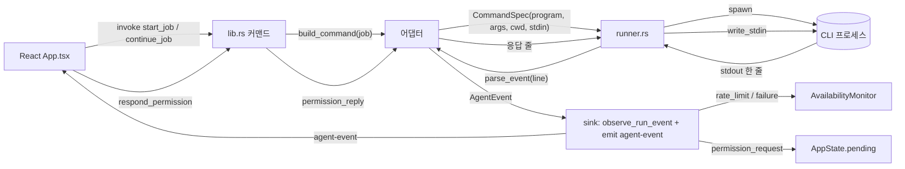
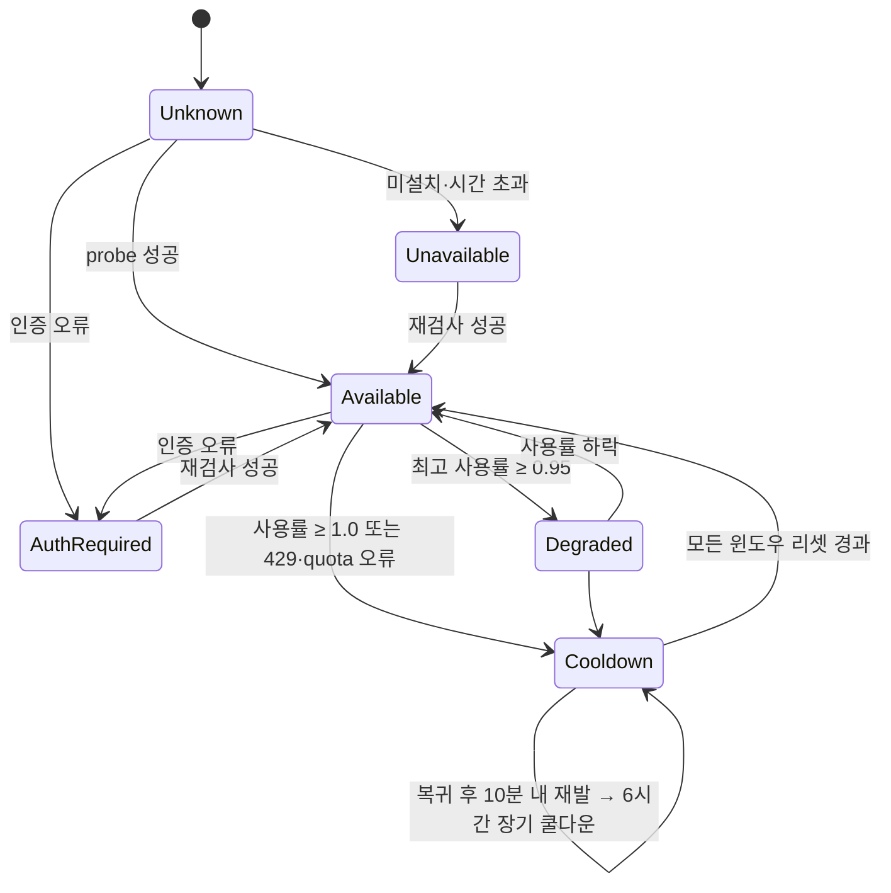
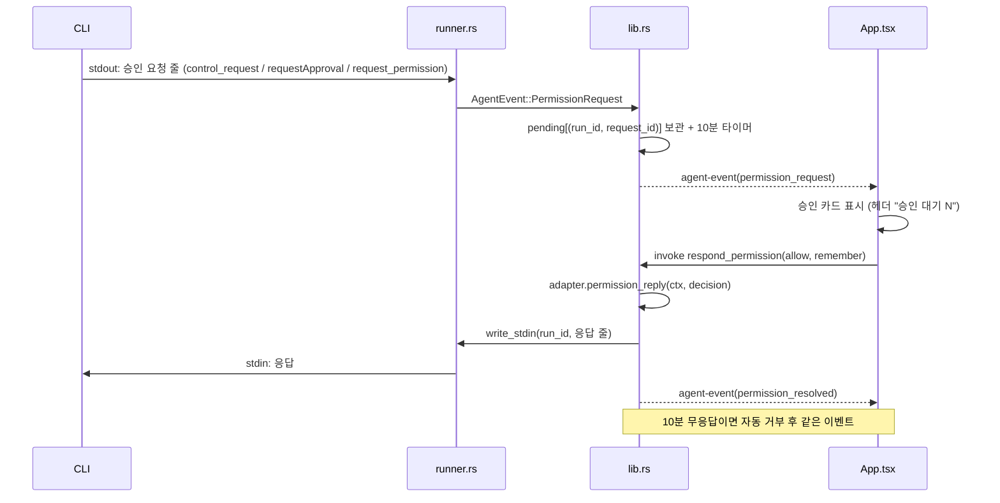

# Agent Dock

> PC에 설치·로그인된 여러 AI 코딩 CLI(Codex, Claude Code, Antigravity, Gemini CLI, OpenCode)를 **한 창에서 실행**하고, 각 CLI의 **가용성(한도·로그인)**, **우선순위**, **승인 요청**을 함께 관리하는 로컬 Tauri 앱입니다.
> 앱은 토큰을 저장하거나 복사하지 않고, 각 CLI가 이미 갖고 있는 로그인 상태를 그대로 씁니다.

> 💡 **쉽게 말하면**: ChatGPT·Claude·Gemini 같은 "AI 코딩 비서"를 터미널(검은 창)에서 쓰는 프로그램이 여러 개 있는데, 각각 따로 켜고 한도가 차면 다른 걸로 갈아타야 해서 번거롭습니다. Agent Dock은 이것들을 **한 화면에 모아 놓은 리모컨**입니다. "지금 누가 쓸 수 있나"를 신호등처럼 보여 주고, 대화 도중 다른 AI로 바꿔도 앞 얘기를 요약해서 넘겨 주고, AI가 "이 명령 실행해도 돼요?"라고 물으면 화면에서 허용/거부 버튼으로 답하게 해 줍니다.

- 저장소 요약·다음 작업: [`HANDOFF.md`](HANDOFF.md)
- 개발 환경: Windows 11, Rust 1.98, Node 22, Tauri 2 (2026-09 기준)
- 이 문서는 "어떻게 만들었고 무엇을 배웠는지"를 공유하기 위한 학습용 기록을 겸합니다. 어려운 용어에는 `💡` 표시로 쉬운 풀이를 달아 두었습니다.

---

## 목차

0. [읽기 전에: 용어 한눈에](#0-읽기-전에-용어-한눈에)
1. [왜 만들었나](#1-왜-만들었나)
2. [핵심 기능](#2-핵심-기능)
3. [화면 구성](#3-화면-구성)
4. [빠른 시작 (다른 컴퓨터에서 실행)](#4-빠른-시작-다른-컴퓨터에서-실행)
5. [아키텍처](#5-아키텍처)
6. [CLI별 프로토콜 실측 노트](#6-cli별-프로토콜-실측-노트)
7. [Windows에서 배운 것들 (함정 모음)](#7-windows에서-배운-것들-함정-모음)
8. [빌드·실행·테스트](#8-빌드실행테스트)
9. [개발 방식](#9-개발-방식)
10. [로드맵과 미구현](#10-로드맵과-미구현)
11. [참고 자료](#11-참고-자료)

---

## 0. 읽기 전에: 용어 한눈에

| 용어 | 쉬운 풀이 |
|---|---|
| **CLI** (Command Line Interface) | 마우스 대신 글자 명령으로 쓰는 프로그램. 여기서는 `claude`, `codex`처럼 터미널에서 실행하는 AI 코딩 도구를 뜻합니다. |
| **에이전트** | 질문에 답만 하는 게 아니라, 파일을 읽고 고치고 명령을 실행하며 스스로 일을 진행하는 AI. |
| **헤드리스** (headless) | 화면 없이 뒤에서 조용히 돌아가는 모드. 사람이 타이핑하는 대화창 대신, 다른 프로그램(우리 앱)이 명령을 넣고 결과를 받아 갑니다. |
| **토큰 / 한도 / 쿨다운** | AI는 글자를 "토큰" 단위로 세고, 구독마다 일정 시간(예: 5시간, 7일) 안에 쓸 수 있는 양(한도)이 정해져 있습니다. 한도를 다 쓰면 리셋될 때까지 기다려야 하는데, 그 대기 상태를 이 앱에서는 **쿨다운**이라 부릅니다. |
| **세션** | AI와 나눈 한 묶음의 대화. 세션 id를 알면 나중에 "아까 그 대화 이어서"를 할 수 있습니다. |
| **handoff (핸드오프)** | 일을 다른 사람에게 넘길 때 쓰는 인수인계. 여기서는 A AI와 하던 대화를 B AI로 넘길 때 "지금까지 이런 얘기를 했다"는 요약을 붙여 주는 것. |
| **승인 (permission)** | AI가 파일을 고치거나 명령을 실행하기 전에 "해도 될까요?"라고 묻는 것. 앱이 그 질문을 받아 사람에게 보여 주고 답을 돌려줍니다. |
| **probe (프로브)** | "살아 있니? 로그인돼 있니?"를 확인하려고 가볍게 찔러 보는 짧은 명령(예: `claude auth status`). |
| **stdin / stdout / stderr** | 프로그램의 입구·출구. stdin(표준 입력)으로 글을 넣고, stdout(표준 출력)으로 결과를 받고, stderr(표준 오류)로 경고·오류가 나옵니다. 우리 앱은 CLI의 이 세 통로에 파이프를 꽂아 대화합니다. |
| **JSON** | 데이터를 `{"이름": "값"}` 모양의 글자로 적는 규칙. 프로그램끼리 주고받기 좋습니다. |
| **JSON-RPC** | JSON으로 "이 함수 실행해 줘(요청)" / "결과는 이거야(응답)"를 주고받는 약속. `id`로 요청과 응답을 짝지웁니다. |
| **프로토콜** | 두 프로그램이 대화하는 규칙. 어떤 순서로 어떤 모양의 메시지를 보내는지. |
| **어댑터** | 플러그 모양이 다른 전기 제품에 끼우는 변환 플러그처럼, CLI마다 다른 말투를 앱의 공통 언어로 바꿔 주는 코드 조각. |
| **러너** (runner) | CLI 프로그램을 실제로 켜고, 입출력 파이프를 붙잡고, 끄는 담당 코드. |
| **이벤트** | "메시지 한 조각 왔음", "도구 실행함", "끝남"처럼 진행 중에 일어나는 일 하나하나. 앱은 이벤트를 받아 화면을 갱신합니다. |
| **스트리밍** | 답이 다 완성될 때까지 기다리지 않고 글자가 생기는 대로 조금씩 받아 보여 주는 방식. |
| **샌드박스** | AI가 실행하는 명령을 안전한 울타리 안에 가두는 것. 예: "이 폴더 밖에는 못 쓰게". 울타리 밖 작업은 승인을 받아야 합니다. |
| **Tauri / Rust / React / Vite / WebView2** | Tauri = 웹 기술로 데스크톱 앱을 만드는 틀. Rust = 뒤에서 무거운 일을 하는 언어(빠르고 안전). React = 화면을 그리는 라이브러리. Vite = 화면 코드를 묶어 주는 도구. WebView2 = Windows에 내장된 "브라우저 엔진"으로, Tauri 앱의 화면이 여기서 그려집니다. |
| **localStorage** | 브라우저(웹뷰) 안의 작은 저장 공간. 설정값을 컴퓨터별로 기억하는 데 씁니다. |
| **라우팅 체인** | "1순위 Claude → 2순위 Codex → …"처럼 어떤 AI를 먼저 쓸지 정해 둔 순서. |
| **상태 머신** | 신호등처럼 정해진 상태(초록·노랑·빨강)와 바뀌는 규칙을 명확히 적어 둔 것. |
| **리셋 윈도우** | 한도가 다시 채워지는 시간 창. Claude는 5시간·7일 두 개, Codex는 5시간·주간 등. |
| **E2E 테스트** (End-to-End) | 부품 하나가 아니라 실제 사용자처럼 처음부터 끝까지 눌러 보는 테스트. |

## 1. 왜 만들었나

AI 코딩 구독을 여러 개 쓰다 보면 실제 병목은 모델 성능이 아니라 **한도**입니다. Claude는 5시간·7일 윈도우, Codex는 5시간·주간 윈도우, Google AI Pro(Antigravity)는 5시간 창 + 주간 상한이 있고, 하나가 막히면 다른 CLI로 넘어가야 합니다. 그런데 CLI마다 세션·도구·이벤트 형식이 달라서 "지금 뭐가 쓸 수 있는지", "어디까지 얘기했는지"를 사람이 기억해야 했습니다.

Agent Dock은 그 기억을 대신합니다.

- 어떤 CLI가 **지금 쓸 수 있는지**(로그인·한도·쿨다운)를 한 줄로 보여 주고,
- 대화 중에 CLI를 **바꿔도 문맥을 이어** 주며(handoff 요약 자동 첨부),
- CLI가 던지는 **도구 승인 요청을 앱 화면에서** 바로 답하게 합니다.

무거운 워크스페이스가 아니라, 필요할 때만 CLI 프로세스를 띄우는 가벼운 런처·세션 관리자를 목표로 했습니다.

> 💡 **쉽게 말하면**: 휴대폰 요금제가 여러 개인데 데이터가 떨어지면 다른 유심으로 갈아 끼워야 하는 상황과 비슷합니다. 이 앱은 "어느 유심에 데이터가 남았는지" 보여 주고, 갈아 끼울 때 통화 내용을 요약해 넘겨 주는 도구입니다. "워크스페이스"는 모든 걸 다 넣은 큰 작업실이고, "런처"는 필요한 프로그램만 켜 주는 작은 실행기입니다. 우리는 작은 쪽을 택했습니다.

## 2. 핵심 기능

| 기능 | 동작 | 관련 코드 |
|---|---|---|
| **채팅 UI + CLI별 세션** | 대화마다 CLI별 세션 id를 따로 기억한다(`sessions[cli] = {sessionId, syncedUpTo}`). 같은 CLI로 이어 보내면 그 CLI의 재개 명령(`--resume`, `thread/resume`, `session/load` 등)을 쓴다 | `src/App.tsx` |
| **대화 중 CLI 전환 (handoff)** | 툴바에서 CLI를 바꾸면 새 CLI가 모르는 항목(다른 CLI에서 오간 사용자·응답·파일 변경)만 골라 요약 문단으로 앞에 붙인다. 16,000자 초과분은 앞부분을 생략 | `buildHandoff` in `App.tsx` |
| **가용성 모니터** | 시작 시 전체 probe, 이후 5분 주기 + 창 포커스 복귀 시 재검사. 공식 사용률(Claude 스트림, Codex app-server)과 실패 문구(429·"exhausted daily quota"·인증 오류)를 상태 머신에 반영 | `availability.rs`, `lib.rs` |
| **드래그 우선순위** | 상단 카드를 끌어 순서를 바꾸면 라우팅 체인·상태바 순서·추천 CLI가 함께 바뀌고 localStorage에 저장 | `set_routing_chain`, `scheduler.rs` |
| **승인 실시간 중계** | Claude(stdio permission prompt), Codex(app-server requestApproval), Gemini(ACP request_permission)가 보내는 도구 승인 요청을 대화 안 카드로 띄우고 허용/세션 동안 허용/거부를 CLI로 돌려준다. 10분 무응답 시 자동 거부 | `respond_permission`, 각 어댑터 `permission_reply` |
| **CLI 레지스트리 패널** | CLI별 사용 여부(끄면 상태바·라우팅·probe에서 제외), 순위, 상태, 로그인 계정, 버전, 로그인 버튼, 모델 선택을 한 표에서 관리 | `App.tsx` 레지스트리 모달 |
| **앱 안에서 로그인** | 각 CLI의 자체 로그인 명령을 새 콘솔 창으로 띄우고, 창이 열린 동안 8초마다 재검사해 로그인되면 바로 초록으로 | `login_cli` in `lib.rs` |
| **모델 선택** | CLI가 제공하는 목록(Codex `model/list`, Gemini/OpenCode ACP·명령, Antigravity `agy models`, Claude는 바이너리 스캔)에서 고르고 실행 인자로 전달 | `model_listing` / `parse_models` |
| **스냅샷 보존** | 가용성이 바뀔 때마다 `%APPDATA%\com.user.agent-dock\availability.json`에 저장하고 재시작 시 복원(지난 리셋 창은 폐기, 진행 중 쿨다운 유지) | `lib.rs` store |
| **여러 줄 프롬프트** | CLI마다 안전한 전달 경로를 골라 줄바꿈이 있는 긴 프롬프트도 그대로 간다(§7) | 각 어댑터 `build_command` |

> 💡 **표 읽는 법**
> - *세션 id*: AI 쪽에 저장된 대화의 번호표. `syncedUpTo`는 "이 AI가 우리 대화 몇 번째 줄까지 알고 있나"를 적어 둔 숫자입니다. 그 뒤의 내용만 골라 인수인계하려고 씁니다.
> - *공식 사용률*: AI 회사가 직접 알려 주는 "지금 몇 % 썼다"는 수치. 이게 없는 CLI(Gemini, Antigravity, OpenCode)는 오류 문구를 보고 짐작(추정)합니다. 429는 "너무 많이 요청했다"는 HTTP 오류 번호입니다.
> - *스트림(stream)*: CLI가 결과를 한 줄씩 흘려보내는 것. 그 줄들 사이에 사용률 같은 정보가 섞여 옵니다.
> - *레지스트리*: 등록부. 어떤 CLI를 켜 둘지, 어떤 모델을 쓸지 적어 두는 설정 표.
> - *바이너리 스캔*: Claude는 "모델 목록 보여 줘" 명령이 없어서, 설치된 프로그램 파일 안에 적힌 모델 이름 글자를 뒤져서 목록을 만듭니다.
> - *스냅샷*: 그 순간의 상태를 사진 찍듯 저장한 것. 앱을 껐다 켜도 "아까 Claude 17% 썼음"을 기억합니다.

## 3. 화면 구성

```
┌ 상단 카드: ① Claude Ready  ② Codex Ready  ③ Antigravity Ready  ④ Gemini Cooldown  ⑤ OpenCode Ready   [승인 대기 1] [⚙ CLI 설정]
├ 왼쪽: 대화 목록 (+ 새 대화)          │ 오른쪽: 대화 본문
│   [claude] Use the Bash tool…  실행 중 │   사용자 말풍선 / 응답(스트리밍) / 도구 호출 줄 / 승인 카드 / 시스템 줄
│                                        │   ┌ 승인 요청 · Bash  Print 5*5 with Python ─────┐
│                                        │   │ $ python -c "print(5*5)"   ▸ 입력 전체      │
│                                        │   │ [허용] [세션 동안 허용] [거부]              │
│                                        │   └─────────────────────────────────────────────┘
├ 툴바: [📁 D:\dev] [CLI ▾] [모델 ▾] [↻] [☐ 파일 쓰기 허용]  추천: Claude        [중지] [자동 전환: 켬]
└ 상태바: ● Claude Ready 17% 01:40↻ 공식 · ● Codex Ready 55% 11:39↻ 공식 · ● Antigravity Ready ? 23:03 재검사 CLI 제시 · …
```

- 카드 색: 초록 = 사용 가능, 노랑 = 임박(사용률 95% 이상), 주황 = 쿨다운, 빨강 = 로그인 필요/사용 불가, 회색 = 미확인.
- 상태바 항목을 클릭하면 상세 패널(윈도우별 사용률·리셋 시각·근거·계정·버전·마지막 오류·재검사·로그인 버튼)이 열립니다.
- "파일 쓰기 허용"은 CLI별 권한 모드로 번역됩니다: Claude `acceptEdits`/`plan`, Codex 샌드박스 `workspace-write`/`read-only`, Gemini `auto_edit`/`plan`, Antigravity `accept-edits`/`plan`, OpenCode 에이전트 `build`/`plan`.

> 💡 **쉽게 말하면**: 위 그림은 앱 창을 글자로 그린 것입니다. 맨 위 카드는 AI 5개의 신호등, 왼쪽은 카톡 채팅방 목록, 오른쪽은 채팅 내용, 아래 툴바는 "어느 폴더에서, 어느 AI로, 파일 수정을 허락할지" 고르는 곳입니다. "파일 쓰기 허용"을 끄면 AI는 읽기만 하고(plan 모드), 켜면 파일을 고칠 수 있는 대신 위험한 명령은 여전히 승인을 묻습니다. `01:40↻`는 "01:40에 한도가 다시 채워짐", `공식`은 "AI 회사가 알려 준 정확한 수치", `CLI 제시`는 "로그인만 확인됨, 사용량은 모름"이라는 뜻입니다.

## 4. 빠른 시작 (다른 컴퓨터에서 실행)

Windows 10/11 전용입니다(콘솔 로그인 창·`.cmd` 셔틀 해석·winget 경로가 Windows 기준). 비공개 저장소이므로 `gh auth login`을 소유 계정으로 먼저 합니다.

> 💡 *winget*은 Windows에 기본 들어 있는 "프로그램 설치 명령"입니다(앱스토어의 명령어 버전). *gh*는 GitHub를 터미널에서 다루는 도구이고, *비공개 저장소*는 로그인한 소유자만 볼 수 있는 코드 창고입니다.

### 4-1. 개발 도구

| 도구 | 설치 | 비고 |
|---|---|---|
| Git | `winget install Git.Git` | 코드 변경 이력을 관리하는 도구 |
| GitHub CLI | `winget install GitHub.cli` → `gh auth login` | 비공개 저장소 clone(내려받기)용 |
| Node.js 22 LTS | `winget install OpenJS.NodeJS.LTS` | 화면(React) 쪽을 만들고 CLI들을 설치하는 실행기. LTS = 오래 지원되는 안정판 |
| Rust | `winget install Rustlang.Rustup` → 새 창에서 `rustup default stable-msvc` | 뒤쪽(백엔드) 언어. rustup = Rust 설치 관리자, msvc = Windows용 컴파일러 계열 |
| VS Build Tools 2022 | `winget install Microsoft.VisualStudio.2022.BuildTools` → 설치 관리자에서 **"C++를 사용한 데스크톱 개발"** 워크로드 | Rust가 Windows 프로그램을 최종 조립(링크)할 때 필요한 부품 |
| WebView2 | Windows 11 기본 포함. 없으면 "WebView2 Evergreen Runtime" | 앱 화면을 그리는 브라우저 엔진 |

디스크는 8 GB 이상 비워 두세요(`src-tauri\target`이 6~7 GB). C: 여유가 적으면 설치 전에 사용자 환경 변수 `RUSTUP_HOME`·`CARGO_HOME`을 다른 드라이브(예: `D:\tools\rustup`, `D:\tools\cargo`)로 두고 `CARGO_HOME\bin`을 PATH에 넣습니다(§7 참고).

> 💡 *환경 변수*는 "프로그램들이 공통으로 참고하는 이름표"입니다. `CARGO_HOME`은 Rust 부품 창고 위치, `PATH`는 "명령어를 어디서 찾을지" 적어 둔 폴더 목록입니다. `target` 폴더는 Rust가 만든 중간 산출물이 쌓이는 곳이라 크기가 큽니다.

### 4-2. 쓸 CLI 설치·로그인

앱은 설치되어 로그인된 CLI만 씁니다. 하나만 있어도 동작하고, 안 쓰는 CLI는 ⚙ CLI 설정에서 끌 수 있습니다.

| CLI | 설치 | 로그인 |
|---|---|---|
| Claude Code | `npm i -g @anthropic-ai/claude-code` | `claude auth login` |
| Codex | `npm i -g @openai/codex` | `codex login` |
| Antigravity (Google AI Pro) | `winget install Google.AntigravityCLI` | 터미널에서 `agy` 첫 실행 → 브라우저 로그인 |
| Gemini CLI (선택) | `npm i -g @google/gemini-cli` | `gemini` → `/auth` (개인 Google 로그인은 2026-06 종료, API 키만) |
| OpenCode (선택) | `npm i -g opencode-ai` | `opencode auth login` |

> 💡 `npm i -g …`는 "Node.js 프로그램을 컴퓨터 전체에서 쓰게 설치"라는 뜻입니다. 로그인은 각 회사 사이트에 브라우저로 한 번 하면 그 CLI가 자기 자리에 인증 정보를 저장해 두고, 앱은 그걸 건드리지 않고 "이미 로그인돼 있네"만 확인합니다. *API 키*는 비밀번호 대신 쓰는 긴 문자열 열쇠입니다.

### 4-3. 받아서 실행

```powershell
gh repo clone bin7335/agent-dock
cd agent-dock
npm install
npm run tauri dev        # 첫 빌드 5~10분, 이후 src-tauri 변경 시 자동 재빌드
```

설치 파일: `npm run tauri build` → `src-tauri\target\release\bundle\` (msi·nsis).

> 💡 `clone` = 코드 창고를 내 컴퓨터에 복사, `npm install` = 화면 쪽 부품 내려받기, `tauri dev` = 개발용으로 앱을 켜기(코드를 고치면 자동으로 다시 켜짐), `tauri build` = 남에게 줄 수 있는 설치 파일 만들기. *빌드*는 사람이 쓴 코드를 컴퓨터가 실행할 수 있는 형태로 조립하는 과정입니다.

### 4-4. 처음 켰을 때

1. 상단 카드 색을 봅니다. 빨강이면 상태바 → 상세 패널 → 로그인 버튼으로 그 CLI의 로그인 콘솔을 띄웁니다.
2. ⚙ CLI 설정에서 안 쓰는 CLI를 끄고 모델을 고릅니다.
3. 툴바에서 프로젝트 폴더를 고른 뒤 메시지를 보냅니다.

### 4-5. AI 에이전트에게 시키기

다른 PC의 로컬 코딩 에이전트(Codex CLI, Claude Code, Antigravity, Gemini CLI 등)에 저장소 주소를 주고 설치·실행을 맡길 수 있습니다. 조건은 세 가지입니다.

1. **GitHub 인증**: 비공개 저장소라 그 PC에서 `gh auth login`(소유 계정, 브라우저 인증)을 먼저 해 두어야 clone이 됩니다. 인증 없이 주소만 주면 "repository not found"로 실패합니다.
2. **Windows 로컬 에이전트**: 앱 실행 방식이 Windows 전용이라 클라우드(리눅스 컨테이너) 에이전트는 코드를 읽고 `cargo test` 정도만 할 수 있고 앱을 띄우지는 못합니다. VS Build Tools 설치는 관리자 권한을 묻고, 첫 빌드는 5~10분·디스크 8 GB가 필요합니다.
3. **CLI 로그인은 사람이**: 앱은 토큰을 갖지 않으므로 `claude auth login`, `codex login`, `agy` 첫 실행 같은 브라우저 로그인은 직접 해야 합니다. 에이전트는 그 단계에서 멈추고 알려 주도록 지시합니다.

지시문 예시:

```text
https://github.com/bin7335/agent-dock 는 내 비공개 저장소야. gh auth login이 되어 있는지 확인하고
gh repo clone bin7335/agent-dock 으로 받은 뒤 README.md 4장 "빠른 시작" 순서대로
개발 도구(Node 22, Rust stable-msvc, VS Build Tools C++ 워크로드)를 설치하고
npm install → npm run tauri dev 로 실행해줘. 디스크가 부족하면 CARGO_HOME/RUSTUP_HOME을
다른 드라이브로 잡아. CLI 로그인(claude auth login, codex login, agy)은 내가 직접 할 테니
그 단계에서는 멈추고 알려줘.
```

> 💡 *로컬 에이전트*는 내 컴퓨터 안에서 도는 AI, *클라우드 에이전트*는 회사 서버(대개 리눅스)에서 도는 AI입니다. 이 앱은 Windows 방식으로 만들어져 리눅스에서는 켤 수 없습니다.

## 5. 아키텍처

> 💡 *아키텍처*는 건물의 설계도처럼 "프로그램이 어떤 부품으로, 어떻게 연결돼 있는지"를 말합니다.

### 5-1. 기술 스택

| 층 | 선택 | 이유 |
|---|---|---|
| 데스크톱 셸 | **Tauri 2** | 웹뷰 기반이라 가볍고(설치 5 MB대), Rust 백엔드에서 프로세스를 직접 다룰 수 있음 |
| 백엔드 | **Rust** + tokio(비동기 프로세스·stdin/stdout 스트림) + serde_json | CLI마다 다른 JSON 스트림을 줄 단위로 파싱하고 stdin을 열어 둔 채 양방향 통신 |
| 프론트 | **React 19 + TypeScript + Vite 7** | 단일 파일(`App.tsx`)에 대화·상태바·레지스트리·승인 카드 |
| 저장 | localStorage(우선순위·사용 여부·모델) + JSON 파일(가용성 스냅샷) | SQLite 스키마(`db.rs`)는 준비만 됨 |

> 💡 **층 설명**: *데스크톱 셸*은 창·메뉴·설치 파일 같은 "껍데기", *백엔드*는 보이지 않는 곳에서 CLI를 켜고 파이프를 다루는 "엔진", *프론트*는 눈에 보이는 화면입니다. *tokio*는 Rust에서 여러 일을 동시에(비동기) 처리하게 해 주는 부품, *serde_json*은 JSON을 읽고 쓰는 부품, *TypeScript*는 실수를 미리 잡아 주는 자바스크립트, *SQLite*는 파일 하나짜리 작은 데이터베이스입니다. *파싱*은 글자를 읽어 구조를 알아내는 것, *양방향 통신*은 보내기만이 아니라 받기도 한다는 뜻입니다.

### 5-2. 저장소 구조

```
agent-dock/
├─ src/                      프론트 (React)
│  ├─ App.tsx      1,009줄   대화·세션·handoff·승인 카드·상태바·레지스트리·드래그
│  ├─ types.ts       103줄   Rust 이벤트/스냅샷 타입 미러
│  └─ App.css        725줄
├─ src-tauri/src/            백엔드 (Rust)
│  ├─ lib.rs         800줄   Tauri 커맨드, 가용성 루프, probe 실행, 로그인 흐름, 승인 대기 관리
│  ├─ runner.rs      581줄   프로세스 실행·stdin 유지·후속 쓰기·중지·타임아웃, PATH 해석
│  ├─ availability.rs 833줄  CLI별 스냅샷 상태 머신, 오류 분류, 리셋/retry-after 파싱, 저장/복원
│  ├─ scheduler.rs   121줄   라우팅 체인과 후보 선택(pick_candidate)
│  ├─ models.rs       93줄   CliId·Job·CommandSpec·HandoffPacket
│  ├─ db.rs           70줄   SQLite 스키마(미배선)
│  └─ adapters/
│     ├─ mod.rs      292줄   어댑터 계약(trait)·공통 이벤트·헬퍼
│     ├─ claude.rs   623줄   stream-json + stdio permission prompt
│     ├─ codex.rs    773줄   app-server JSON-RPC
│     ├─ gemini.rs   801줄   ACP(JSON-RPC 2.0)
│     ├─ antigravity.rs 321줄  agy stream-json
│     └─ opencode.rs 357줄   run --format json
├─ HANDOFF.md                다음 세션용 요약
└─ README.md
```

> 💡 **파일 역할을 한 줄씩**: `App.tsx`는 화면 전체. `types.ts`는 Rust가 보내는 데이터 모양을 화면 쪽에도 똑같이 적어 둔 것(*미러*). `lib.rs`는 화면의 요청을 받는 창구(*Tauri 커맨드* = 화면이 부를 수 있는 백엔드 함수). `runner.rs`는 CLI를 켜고 끄는 담당. `availability.rs`는 신호등 규칙. `scheduler.rs`는 "다음엔 누구?"를 고르는 규칙. `models.rs`는 데이터 모양 정의. `adapters/`는 CLI별 변환 플러그. *스키마*는 데이터베이스 표의 설계, *미배선*은 만들어 두고 아직 연결하지 않았다는 뜻입니다.

### 5-3. 이벤트 파이프라인



핵심은 **어댑터가 상태를 갖지 않는다**는 점입니다. 어댑터는 "명령을 어떻게 조립하고, 한 줄을 어떤 공통 이벤트로 바꾸고, 승인 응답을 어떤 문자열로 만들지"만 압니다. 프로세스·대기 요청·타이머 같은 상태는 러너와 `lib.rs`가 갖습니다. 덕분에 CLI 하나를 추가할 때 파일 하나만 만들면 됩니다.

공통 이벤트(`AgentEvent`): `SessionStarted` · `Message{text, delta}` · `ToolUse` · `FileChange` · `RateLimit{window, utilization, resets_at}` · `Completed{ok, summary}` · `Stderr` · `ProcessExited{code, cancelled}` · `PermissionRequest{request_id, tool, description, input, can_remember, suggestions}` · `PermissionResolved`.

> 💡 **그림을 말로 풀면**: ① 사용자가 메시지를 보내면 화면(UI)이 백엔드 창구(`lib.rs`)를 부릅니다. ② 창구는 어댑터에게 "이 CLI는 어떤 명령으로 켜야 해?"를 물어 명령 설명서(`CommandSpec`: 프로그램 이름, 인자, 작업 폴더, 넣어 줄 입력)를 받습니다. ③ 러너가 그 설명서대로 CLI를 켜고(*spawn*), CLI가 한 줄씩 뱉는 출력을 어댑터에게 넘겨 공통 이벤트로 번역시킵니다. ④ 번역된 이벤트는 신호등(모니터)도 갱신하고, 승인 요청이면 대기 목록에 넣고, 화면에도 보냅니다. ⑤ 사용자가 승인 버튼을 누르면 반대 방향으로 CLI의 입력 통로(stdin)에 답을 써 넣습니다.
> *상태를 갖지 않는다*는 말은 "어댑터는 기억을 하지 않는 번역기"라는 뜻입니다. 기억(누가 실행 중인지, 무엇을 기다리는지)은 한 곳(러너·창구)에만 두어야 꼬이지 않습니다. `delta`는 "이전 조각에 이어 붙이는 글자 조각"(스트리밍), `utilization`은 사용률(0~1), `resets_at`은 리셋 시각입니다.

### 5-4. 어댑터 계약 (`adapters/mod.rs`의 `CliAdapter` trait)

| 메서드 | 역할 | 비고 |
|---|---|---|
| `probe_command` / `probe_exchange` + `interpret_probe(_lines)` | 설치·로그인 확인 | Claude `auth status`, Codex `login status`, Gemini·OpenCode·Antigravity는 각자 방식 |
| `build_command(job)` / `build_resume_command(job, session_id)` | 실행·재개 명령 조립 | 프롬프트는 `CommandSpec.stdin`으로 |
| `parse_event(line)` | stdout 한 줄 → `Vec<AgentEvent>` | 모르는 줄은 빈 벡터 |
| `keeps_stdin_open` | 실행 중 stdin을 열어 둘지 | Claude·Codex·Gemini = true |
| `stdin_follow_up(job, session_id)` → `LineReaction{send, drop_events}` | stdout 줄을 보고 stdin으로 이어 보낼 줄(Codex `turn/start`, Gemini `session/prompt`)과 이벤트 버림 여부(세션 복원 재생 구간) | 상태가 필요하면 클로저 안 Atomic |
| `permission_reply(ctx, decision)` | 승인 응답 문자열 | CLI마다 다른 형식 |
| `filter_stderr(line)` | stderr 줄 정리 | Codex tracing 로그는 ERROR·WARN만, Gemini 객체 덤프는 message 줄만 |
| `rate_limit_exchange` + `parse_rate_limits` + `parse_account` | 공식 사용량·계정 | Codex app-server |
| `login_flow` / `version_command` / `model_listing` + `parse_models` / `scan_models` | 로그인·버전·모델 목록 | |

> 💡 **계약(trait)이란**: "우리 앱의 어댑터라면 이 함수들을 갖춰야 한다"는 체크리스트입니다. Rust에서는 *trait*라고 부릅니다. 새 CLI를 붙일 때 이 표의 함수만 채우면 나머지 앱은 손대지 않아도 됩니다. 대부분은 기본값이 있어서(예: 승인 중계를 지원하지 않으면 `permission_reply`는 "없음"을 돌려줌) 필요한 것만 구현합니다.
> - *메서드*: 어떤 물건(여기서는 어댑터)이 할 수 있는 동작 하나.
> - *Vec*: 목록. `Vec<AgentEvent>`는 "이벤트 여러 개".
> - *클로저*: 나중에 실행하려고 접어 둔 작은 함수. 안에 값을 담아 둘 수 있습니다. *Atomic*은 여러 작업이 동시에 건드려도 깨지지 않는 스위치형 변수입니다.
> - *tracing 로그*: Codex가 자기 내부 상황을 시시콜콜 적어 내는 일지. 사용자에겐 소음이라 오류·경고만 남깁니다.

### 5-5. 가용성 상태 머신 (`availability.rs`)



| 규칙 | 값 | 상수 |
|---|---|---|
| 임박(노랑) 임계치 | 사용률 95% | `HIGH_USAGE_THRESHOLD` |
| 주기 probe | 5분 | `PROBE_INTERVAL_SECS` |
| 추정 쿨다운(리셋 시각을 모를 때) | 30분 | `DEFAULT_COOLDOWN_SECS` |
| 재발 판정 창 / 장기 쿨다운 | 10분 / 6시간 | `RELAPSE_WINDOW_SECS`, `LONG_COOLDOWN_SECS` |
| 모니터 틱 | 30초 | `TICK_INTERVAL` |

- **근거(evidence)** 를 함께 보여 줍니다: `공식`(CLI가 준 사용률·리셋), `CLI 제시`(로그인 여부만 확인), `추정`(오류 문구로 추정).
- 오류 원문에서 `resets_at` epoch, `retry-after`/`retryDelay`/`retry in Ns`를 파싱해 정확한 복귀 시각을 씁니다(`extract_reset_epoch`, `extract_retry_after_secs`).
- Claude·Codex처럼 윈도우가 여러 개인 구독은 윈도우별로 사용률·리셋을 따로 들고, **전부 리셋된 뒤에만** 복귀합니다.

> 💡 **신호등 규칙을 말로 풀면**: 처음엔 모름(회색). 확인해 보니 잘 되면 초록(Available), 로그인이 안 됐으면 빨강(AuthRequired), 설치가 안 됐거나 응답이 없으면 빨강(Unavailable). 초록인데 사용률이 95%를 넘으면 노랑(Degraded, "곧 막힘"), 100%가 되거나 "한도 초과" 오류가 나오면 주황(Cooldown, "쉬는 중"). 리셋 시각이 지나면 다시 초록. 그런데 초록으로 돌아온 지 10분도 안 돼 또 막히면 "이 계정은 오늘 글렀다"고 보고 6시간을 쉽니다.
> - *임계치*: 경계선 값. *틱*: 30초마다 한 번씩 시계를 보는 것. *epoch*: 1970년 1월 1일부터 센 초 단위 시각(컴퓨터가 시각을 적는 흔한 방식). *retry-after*: 서버가 "N초 뒤에 다시 와"라고 알려 주는 값.

### 5-6. 라우팅과 추천

`scheduler::pick_candidate`는 라우팅 체인(상단 카드 순서) 순으로 **켜져 있고 Available**인 CLI를 고르고, 없으면 Degraded를 고릅니다. 지금은 "추천: Claude"처럼 안내만 하며, 쿨다운 시 자동 재개(2단계 자동 폴백)는 다음 작업입니다.

> 💡 *폴백(fallback)*은 "1순위가 안 되면 2순위로"라는 예비 계획입니다. 지금은 앱이 "Claude 쓰세요"라고 추천만 하고, 자동으로 갈아타는 기능은 아직 없습니다.

### 5-7. 승인 실시간 중계



CLI마다 응답 형식이 다르므로(§6) `suggestions`에 CLI가 준 선택지 원문(JSON)을 그대로 실어 두었다가 응답에 되돌려 줍니다. "세션 동안 허용" 버튼은 CLI가 그런 선택지를 제공할 때만 보입니다.

> 💡 **순서도를 말로 풀면**: AI가 "이 명령 실행해도 돼?"라는 줄을 출력 → 러너가 받아 창구에 전달 → 창구는 "답 기다리는 중" 목록에 적고 10분 타이머를 켬 → 화면에 카드가 뜸 → 사용자가 [허용]을 누르면 창구가 어댑터에게 "이 CLI 말투로 '허용' 문장 만들어 줘" → 러너가 AI의 입력 통로에 써 넣음 → 화면 카드가 "허용됨"으로 바뀜. 10분 동안 아무도 안 누르면 앱이 대신 "거부"를 보내 AI가 영원히 기다리지 않게 합니다.
> *세션 동안 허용*은 "이번 대화에서는 같은 종류를 다시 묻지 마"입니다. AI 회사마다 이 선택지를 주기도, 안 주기도 해서 버튼이 있을 때만 보입니다.

### 5-8. 대화 중 CLI 전환

프론트가 대화 항목마다 `syncedUpTo`(그 CLI가 이미 아는 항목 수)를 기억합니다. 다른 CLI로 바꿔 보내면 그 뒤의 사용자·응답·파일 변경 항목만 골라 "그사이 대화" 문단을 만들고, 새 CLI면 새 세션을, 이미 세션이 있으면 재개 명령을 씁니다. 실행이 끝날 때 `syncedUpTo`를 갱신합니다.

> 💡 친구 A와 얘기하다가 친구 B를 부르면 "A랑 여기까지 얘기했어"라고 알려 줘야 B가 이어서 말할 수 있습니다. 앱은 각 친구가 "몇 번째 말까지 들었는지"를 적어 두고, 못 들은 부분만 요약해 전해 줍니다.

## 6. CLI별 프로토콜 실측 노트

모두 2026-09 초 실제 버전으로 직접 확인한 내용입니다. 공식 문서가 얇은 부분이라 학습 가치가 큽니다.

> 💡 **이 장을 읽는 요령**: 아래 코드 블록은 우리 앱과 CLI가 실제로 주고받은 문장(JSON)입니다. `→`는 앱이 CLI에게 보낸 것, `←`는 CLI가 앱에게 준 것. 각 CLI마다 "대화를 시작하는 법 / 이어가는 법 / 승인을 묻고 답하는 법 / 사용량을 알려 주는 법"이 다르고, 그 차이를 어댑터가 흡수합니다. 문장 안의 `…`은 길어서 줄인 부분입니다.

### 6-1. Claude Code 2.1.259 — stream-json + stdio permission prompt

```
claude -p --output-format stream-json --verbose --input-format stream-json \
       --permission-prompt-tool stdio --permission-mode acceptEdits|plan [--model X] [--resume ID]
```

- 프롬프트는 stdin으로 한 줄 JSON: `{"type":"user","message":{"role":"user","content":[{"type":"text","text":"…"}]}}` (여러 줄도 안전).
- stdout 이벤트: `system/init`(session_id), `assistant`(content: text·tool_use), `user`(tool_result), `rate_limit_event`(`rate_limit_info.unifiedWindows.five_hour|seven_day{utilization, resetsAt}` — **공식 사용률**), `result`.
- 승인이 필요하면 `{"type":"control_request","request_id":"…","request":{"subtype":"can_use_tool","tool_name":"Bash","input":{…},"description":"…","permission_suggestions":[…]}}`가 오고, stdin으로 `{"type":"control_response","response":{"subtype":"success","request_id":"…","response":{"behavior":"allow","updatedInput":{…},"updatedPermissions":[…]}}}` 또는 `{"behavior":"deny","message":"…"}`를 보냅니다(Claude Agent SDK와 같은 프로토콜).
- `result` 뒤에도 프로세스는 stdin이 닫힐 때까지 살아 있으므로 러너가 결과를 받으면 stdin을 닫습니다.
- 동작 메모: `acceptEdits`는 파일 편집뿐 아니라 `echo >`·`mkdir` 같은 파일시스템 Bash도 자동 승인, `plan`은 `echo` 같은 읽기 전용 명령을 묻지 않음 → 승인 카드는 python·npm·git 쓰기 같은 명령에서 뜹니다.
- 모델 목록 명령이 없어 설치된 네이티브 바이너리(`claude.exe`)를 스캔해 `claude-<계열>-<버전>` 문자열을 뽑습니다.

> 💡 **쉽게 말하면**: Claude는 "한 줄에 JSON 하나" 형식으로 대화합니다(`stream-json`). `-p`는 헤드리스 모드, `--permission-prompt-tool stdio`는 "허락이 필요하면 화면에 묻지 말고 입출력 통로로 나(앱)한테 물어봐"라는 옵션입니다. 그러면 Claude가 `control_request`(허락 요청)를 보내고, 앱이 `control_response`(허락/거부)를 돌려줍니다. `--resume ID`는 "아까 그 대화 이어서". *Agent SDK*는 Anthropic이 개발자용으로 제공하는 도구 모음인데, 그것과 같은 규칙을 우리가 직접 흉내 낸 것입니다. `acceptEdits`/`plan`은 권한 모드 이름입니다(파일 편집 자동 허용 / 읽기만).

### 6-2. Codex 0.152.1 — `codex app-server` JSON-RPC (jsonrpc 필드 없음)

스키마는 `codex app-server generate-json-schema --out <dir>`로 뽑을 수 있습니다(616개 정의).

```
→ {"id":1,"method":"initialize","params":{"clientInfo":{"name":"agent-dock","title":"Agent Dock","version":"0.1.0"}}}
→ {"method":"initialized","params":{}}
→ {"id":2,"method":"thread/start","params":{"cwd":"D:\\dev","approvalPolicy":"on-request","sandbox":"read-only","model":"gpt-5.6-sol"}}
← {"id":2,"result":{"thread":{"id":"01a0…"},"model":"gpt-5.6-sol",…}}
→ {"id":3,"method":"turn/start","params":{"threadId":"01a0…","input":[{"type":"text","text":"…"}]}}
← {"method":"item/agentMessage/delta","params":{"delta":"I"}}                      (스트리밍)
← {"method":"item/started","params":{"item":{"type":"commandExecution","command":"…"}}}
← {"method":"thread/status/changed","params":{"status":{"type":"active","activeFlags":["waitingOnApproval"]}}}
← {"method":"item/commandExecution/requestApproval","id":0,"params":{"reason":"Allow creating x.txt?","command":"…","cwd":"…","availableDecisions":["accept",{"acceptWithExecpolicyAmendment":{…}},"cancel"]}}
→ {"id":0,"result":{"decision":"accept"}}        (accept | acceptForSession | decline | cancel)
← {"method":"account/rateLimits/updated","params":{"rateLimits":{"primary":{"usedPercent":52,"windowDurationMins":10080,"resetsAt":…}}}}
← {"method":"turn/completed","params":{"turn":{"status":"completed","error":null}}}
```

- 재개는 `thread/resume{threadId}`. stdin을 닫으면 종료 코드 0.
- 사용량·계정·모델 목록도 같은 채널: `account/rateLimits/read`, `account/read`(email·planType), `model/list{limit}`.
- 샌드박스(`read-only`/`workspace-write`)가 막은 명령을 모델이 `on-request` 정책으로 다시 요청하면 승인 요청이 옵니다. 앱은 `decline`으로 답해도 턴이 이어지는 것을 확인했습니다.
- stderr에 tracing 로그가 섞이므로 ERROR·WARN만 남깁니다.

> 💡 **쉽게 말하면**: Codex는 "서버처럼 켜 두고 요청을 보내는" 방식(`app-server`)입니다. 순서는 ① `initialize` 인사 → ② `thread/start`로 대화 스레드(=세션) 만들기(작업 폴더, 승인 정책, 샌드박스, 모델 지정) → ③ 받은 스레드 번호로 `turn/start`에 실제 질문 넣기 → ④ 답이 조각(`delta`)으로 흘러오고, 명령을 실행하려다 샌드박스에 막히면 `requestApproval`로 물어봄 → ⑤ 앱이 `accept`/`decline`으로 답 → ⑥ 중간에 사용량(`rateLimits/updated`)도 알려 줌 → ⑦ `turn/completed`로 끝. *스키마*는 "이 서버가 받아들이는 모든 메시지의 모양을 적은 사전"이고, Codex가 명령 하나로 뽑아 줘서 추측 없이 만들 수 있었습니다. *턴*은 질문 하나에 답 하나까지의 한 바퀴, *종료 코드 0*은 "정상 종료"라는 컴퓨터식 표현입니다.

### 6-3. Gemini CLI 0.54.4 / OpenCode 1.18.5 — ACP (Agent Client Protocol, JSON-RPC 2.0)

```
→ {"jsonrpc":"2.0","id":1,"method":"initialize","params":{"protocolVersion":1,"clientCapabilities":{"fs":{"readTextFile":false,"writeTextFile":false}}}}
→ {"jsonrpc":"2.0","id":2,"method":"session/new","params":{"cwd":"D:\\dev","mcpServers":[]}}
← {"jsonrpc":"2.0","id":2,"result":{"sessionId":"…","modes":{…},"models":{"availableModels":[…]}}}
→ {"jsonrpc":"2.0","id":3,"method":"session/prompt","params":{"sessionId":"…","prompt":[{"type":"text","text":"…"}]}}
← {"jsonrpc":"2.0","method":"session/update","params":{"update":{"sessionUpdate":"agent_message_chunk","content":{"type":"text","text":"…"}}}}
← {"jsonrpc":"2.0","method":"session/update","params":{"update":{"sessionUpdate":"tool_call","title":"Writing to x.txt","kind":"edit",…}}}
← {"jsonrpc":"2.0","id":0,"method":"session/request_permission","params":{"options":[{"optionId":"proceed_always","kind":"allow_always"},{"optionId":"proceed_once","kind":"allow_once"},{"optionId":"cancel","kind":"reject_once"}],"toolCall":{…}}}
→ {"jsonrpc":"2.0","id":0,"result":{"outcome":{"outcome":"selected","optionId":"proceed_once"}}}
← {"jsonrpc":"2.0","id":3,"result":{"stopReason":"end_turn"}}
```

- Gemini: `gemini --acp --approval-mode auto_edit|plan [-m 모델]`. 재개는 `session/load{sessionId}`인데 응답 전에 **과거 대화를 session/update로 다시 흘려보내므로** 그 구간의 이벤트를 버려야 합니다(`LineReaction.drop_events`). stdin을 닫아도 프로세스가 안 끝나 러너가 5초 뒤 정리합니다. probe도 ACP `session/new`가 성공하는지로 인증을 판별합니다("Authentication required" 오류 = 로그인 필요).
- Gemini CLI는 2026-06-18부터 개인 Google 계정(무료·AI Pro·Ultra) 로그인을 끊었습니다(`IneligibleTierError` → Antigravity로 이전). 그래서 AI Pro 구독은 Antigravity CLI로 연결합니다.
- OpenCode도 `opencode acp`로 같은 프로토콜을 말합니다(`configOptions`로 model·mode(build/plan) 선택, `usage_update`로 토큰 수, sessionCapabilities resume/fork/list). 다만 기본 설정에서는 bash 실행에 승인을 묻지 않아 지금은 `opencode run --format json`을 그대로 씁니다.

> 💡 **쉽게 말하면**: ACP는 "AI 에이전트와 편집기(클라이언트)가 대화하는 공용 표준"입니다. 회사마다 제각각인 Claude·Codex와 달리, Gemini와 OpenCode는 같은 표준을 쓰니 코드도 거의 같습니다. 순서는 `initialize`(인사, 우리가 할 수 있는 것 알려 주기) → `session/new`(세션 만들기) → `session/prompt`(질문) → `session/update`(답 조각·도구 실행 알림) → `session/request_permission`(허락 요청, 선택지 목록이 같이 옴) → 우리가 선택지 번호로 답 → `stopReason: end_turn`(답 끝).
> *과거 대화를 다시 흘려보낸다*는 건, 예전 세션을 다시 열면 Gemini가 "지난 대화 복습"을 처음부터 다시 출력한다는 뜻입니다. 그대로 화면에 그리면 같은 말이 두 번 나오니 그 구간은 버립니다. *mcpServers*는 AI에 붙이는 외부 도구 서버 목록인데 우리는 안 씁니다(빈 목록).

### 6-4. Antigravity CLI 1.1.26 (`agy`)

```
agy -p "<프롬프트>" --output-format stream-json --mode plan|accept-edits [--dangerously-skip-permissions] [--model X] [--conversation ID] --print-timeout 30m
```

- 이벤트: `init`(conversation_id) → `step_update`(text_delta·tool_info) → `result`(status·response·usage).
- 모델 목록은 `agy models`(탭 구분, AI Pro 기준 14종: gemini 3.x flash/pro, claude-sonnet/opus, gpt-oss). 사용량은 TUI `/usage`뿐이라 헤드리스 신호가 없어 추정 경로로 다룹니다.
- winget 설치 경로가 PATH에 안 잡히는 셸이 있어 러너가 `%LOCALAPPDATA%\Microsoft\WinGet\Links`를 예비로 찾습니다.

> 💡 **쉽게 말하면**: Antigravity는 Google이 개인 사용자용으로 새로 낸 CLI입니다(Gemini CLI가 개인 로그인을 끊으면서 이쪽으로 옮김). 질문을 인자로 주면 답이 조각으로 오고 마지막에 `result`가 옵니다. 승인을 물어보는 통로가 없어서, 읽기 전용(plan) 모드에서는 위험한 일을 그냥 거절하고, 쓰기 모드에서는 `--dangerously-skip-permissions`("묻지 말고 해")로 켭니다. *TUI*는 터미널 안의 화면형 프로그램(사람이 직접 보는 모드)이고, 사용량은 거기서 `/usage`를 쳐야만 볼 수 있어 앱은 추정에 의존합니다.

### 6-5. OpenCode 1.18.5 (`opencode run`)

```
opencode run --format json --dir <폴더> --agent plan|build [--auto] [-m provider/model] [--session ID] "<메시지>" [-f 임시파일]
```

- 이벤트 `text`·`step_finish`. 줄바꿈이 있는 메시지는 `.cmd` 셔틀을 못 통과하므로 임시 파일로 첨부(`-f`, 메시지 뒤에 둬야 함).
- probe는 `opencode auth list`("N credentials"), 모델은 `opencode models`.
- 약관상 Claude 구독 OAuth를 OpenCode에 연결하지 않고 자체 제공자만 씁니다.

> 💡 **쉽게 말하면**: OpenCode는 오픈소스 AI 코딩 도구로, 여러 회사 모델을 골라 붙일 수 있습니다. 우리는 "질문 하나 주고 답 받기" 모드(`run`)로 씁니다. 긴 여러 줄 질문은 Windows 실행 방식 때문에 통째로 못 넘겨서 임시 파일에 적어 첨부합니다. *OAuth*는 "비밀번호 대신 다른 서비스 로그인으로 인증"하는 방식인데, Claude 구독을 OpenCode에 끼워 쓰는 건 약관 위반이라 하지 않습니다.

## 7. Windows에서 배운 것들 (함정 모음)

1. **npm 전역 CLI는 `.cmd` 셔틀이다.** Rust `std::process::Command`로 `.cmd`를 실행하면 cmd.exe를 경유하고(CVE-2024-24576 대응 이스케이프), 줄바꿈이 든 인자는 거부되거나 첫 줄만 전달됩니다. 해결: PATH를 뒤져 **.exe를 우선**으로 실제 파일을 찾고, 프롬프트는 인자가 아니라 **stdin**이나 JSON 메시지로 넘깁니다.
   > 💡 `npm i -g`로 설치한 명령은 진짜 프로그램이 아니라 진짜를 대신 불러 주는 작은 배치 파일(`.cmd`, 셔틀)입니다. 배치 파일은 여러 줄짜리 글을 인자로 받지 못합니다(보안 취약점 CVE-2024-24576 대응으로 Rust가 더 엄격해짐). 그래서 진짜 프로그램(`.exe`)을 직접 찾아 실행하고, 긴 글은 인자가 아닌 입력 통로(stdin)로 넣습니다.
2. **stdin을 열어 둔 채 양방향으로 쓰기.** 승인 응답을 보내려면 프롬프트를 쓴 뒤에도 stdin을 닫지 말아야 합니다. 러너는 `Arc<Mutex<Option<ChildStdin>>>` 슬롯에 stdin을 두고, 프롬프트 쓰기 동안 잠가 응답이 먼저 나가지 않게 합니다. 결과가 오면 닫고, 5초 안에 안 끝나면 죽인 뒤 정상 종료로 봅니다.
   > 💡 보통은 질문을 넣고 입력 통로를 닫습니다("더 할 말 없음"). 그런데 나중에 "허용"이라고 답해야 하니 통로를 열어 둬야 합니다. `Arc<Mutex<Option<…>>>`는 Rust식 표현으로 "여러 작업이 함께 쓰되(Arc), 한 번에 하나만 만지고(Mutex), 비어 있을 수도 있는(Option) 보관함"입니다. 통로를 닫아도 안 끝나는 프로그램은 5초 기다렸다가 강제로 끕니다.
3. **thread id를 받아야 다음 요청을 보낼 수 있는 프로토콜**(Codex turn/start, Gemini session/prompt)은 "stdout 줄에 반응해 stdin으로 이어 보내는" 콜백(`stdin_follow_up`)으로 풀었습니다. 어댑터는 그대로 무상태이고 콜백 안에만 Atomic 플래그를 둡니다.
   > 💡 "세션 만들어 줘" → "번호는 123번" → "그럼 123번에 이 질문" 처럼 앞 답을 봐야 다음 말을 할 수 있는 경우입니다. 미리 다 써 둘 수 없으니 "이런 답이 오면 이렇게 보내라"는 지시(콜백)를 러너에 맡깁니다.
4. **콘솔 로그인 창.** `cmd /c start "" /wait <script.cmd>`로 띄우면 Windows는 배치를 `cmd /K`로 열어 키를 눌러도 창이 안 닫힙니다 → 스크립트 끝에 `exit`. 콘솔은 앱의 PATH를 물려받아 winget `agy`를 못 찾을 수 있으므로 러너가 찾은 실행 파일 경로를 `call`로 부릅니다. 창이 열린 동안 8초마다 재검사해 로그인되는 즉시 초록으로.
   > 💡 앱 안에서 로그인 버튼을 누르면 검은 창이 하나 뜨고 그 안에서 각 CLI의 로그인 명령이 돌아갑니다. 처음엔 창이 안 닫히고(`/K` = "끝나도 창 유지"), 다른 컴퓨터에서는 `agy`를 못 찾는 문제가 있어 둘 다 고쳤습니다.
5. **HTML5 드래그**가 WebView2에서 동작하려면 Tauri 창 설정 `dragDropEnabled: false`가 필요합니다(파일 드롭 처리와 충돌).
   > 💡 상단 카드를 마우스로 끄는 기능이 처음엔 안 됐습니다. Tauri가 "파일을 창에 끌어다 놓기"를 가로채고 있어서, 그 기능을 끄니 카드 드래그가 됐습니다.
6. **Rust 빌드 용량.** `target`이 6~7 GB, VS Build Tools 3 GB, Rust 툴체인 2 GB. C: 여유가 0이 되어 `RUSTUP_HOME`·`CARGO_HOME`·`TEMP`를 D:로 옮겼습니다. 새 컴퓨터에서는 처음부터 다른 드라이브를 잡는 편이 편합니다.
7. **Codex 샌드박스 헬퍼.** `codex-windows-sandbox-setup.exe`가 없으면 모든 쓰기·명령이 거부되고 모델이 같은 오류를 10회 넘게 재시도하며 토큰을 태웁니다 → 서킷 브레이커(동일 오류 3회 → 중단)가 로드맵에 있는 이유.
   > 💡 *서킷 브레이커*는 집의 누전 차단기입니다. 같은 오류가 반복되면 AI가 계속 시도하며 요금(토큰)만 쓰니, 3번 반복되면 자동으로 멈추게 하자는 계획입니다.
8. **Gemini 무료 API 키.** pro 모델 한도가 0이라 매번 429 후 flash로 조용히 폴백하고, 백오프 때문에 한 턴에 2분 넘게 걸리거나 일일 쿼터로 실패합니다. 텔레메트리(`GEMINI_TELEMETRY_*` 로컬 OTLP)에 429의 quotaId·retryDelay가 남는 것을 확인했습니다(미구현 후보).
   > 💡 무료 키로는 좋은 모델(pro)을 못 쓰고, CLI가 몰래 값싼 모델(flash)로 바꿔 답합니다. 실패하면 점점 오래 기다렸다 재시도(*백오프*)해서 느립니다. *텔레메트리*는 프로그램이 남기는 자기 진단 기록이고, *OTLP*는 그 기록의 표준 형식입니다. 거기에 "어느 한도에 걸렸고 몇 초 뒤 재시도"가 적혀 있어 나중에 활용할 수 있습니다.
9. **화면 자동화 E2E(PowerShell).** DPI 125% 모니터에서는 `SetProcessDPIAware` 뒤 `PrintWindow`로 캡처, 클릭은 `SetCursorPos`+`mouse_event`, 한글 IME 때문에 `SendKeys`로 글자를 치지 않고 `Set-Clipboard`+`^v`, 네이티브 `<select>`는 `{HOME}{DOWN}{ENTER}`. PowerShell `-match`는 대소문자를 무시하므로 "Not logged in"이 `Logged in`에 걸립니다(`-cmatch`).
   > 💡 테스트를 사람이 아니라 스크립트가 마우스를 움직이고 키를 눌러서 했습니다. 화면 배율(DPI)이 125%면 캡처가 잘리고, 한글 입력기가 켜져 있으면 타이핑이 자모로 흩어져서 "복사-붙여넣기"로 넣었습니다. `-match`는 대소문자를 구분하지 않아 "로그인 안 됨"을 "로그인 됨"으로 잘못 읽는 실수도 겪었습니다.

## 8. 빌드·실행·테스트

```powershell
npm install
npm run tauri dev            # 개발 실행 (Vite 1420 포트 + Rust 디버그 빌드)
npm run tauri build          # 배포 번들 (src-tauri\target\release\bundle\)
npx tsc --noEmit             # 프론트 타입 검사
cd src-tauri; cargo test     # 단위 테스트 48개 (어댑터 파서·상태 머신·러너 PATH 해석)
cargo test real_claude -- --ignored --nocapture   # 실제 claude를 태우는 통합 테스트 (토큰 사용)
```

> 💡 *디버그 빌드*는 빠르게 만들지만 느리게 도는 개발용, *배포 번들*은 최적화된 설치 파일. *타입 검사*는 "숫자 자리에 글자 넣지 않았나" 같은 실수를 실행 전에 찾는 것. *단위 테스트*는 부품 하나씩 자동으로 검사하는 작은 프로그램들(48개), *통합 테스트*는 진짜 Claude를 불러 확인하는 것이라 요금이 들어 평소엔 건너뜁니다(`--ignored`).

| 타임아웃·주기 | 값 | 위치 |
|---|---|---|
| probe 명령 상한 | 20초 | `PROBE_TIMEOUT` |
| 모델 목록 조회 상한 | 30초 | `MODEL_LIST_TIMEOUT` |
| 로그인 창 상한 / 재검사 주기 | 10분 / 8초 | `LOGIN_TIMEOUT`, `LOGIN_POLL` |
| 승인 무응답 자동 거부 | 10분 | `APPROVAL_TIMEOUT` |
| 결과 뒤 종료 유예 | 5초 | `EXIT_GRACE` |

- 환경 변수: Gemini 실행 시 `GEMINI_CLI_TRUST_WORKSPACE=true`(비신뢰 폴더 헤드리스 거부 우회).
- 데이터 위치: `%APPDATA%\com.user.agent-dock\availability.json`(가용성 스냅샷), 같은 폴더의 `login-<cli>.cmd`(로그인 콘솔 스크립트), 웹뷰 localStorage `agentdock.projectDir/cli/chain/enabled/model.<cli>`.
- Tauri 설정(`src-tauri/tauri.conf.json`): 창 1100×760, `dragDropEnabled:false`, 플러그인 dialog(폴더 선택)·opener.

> 💡 *타임아웃*은 "이만큼 기다렸는데 답 없으면 포기"하는 시간입니다. 너무 짧으면 멀쩡한 CLI를 고장으로 오해하고, 너무 길면 앱이 멈춘 것처럼 보이니 종류별로 다르게 잡았습니다. `%APPDATA%`는 Windows가 프로그램별 설정을 두는 폴더(`C:\Users\이름\AppData\Roaming`)입니다.

## 9. 개발 방식

- **PRD 먼저, 스파이크로 검증.** 요구·설계·오픈소스 조사를 PRD 문서로 정리한 뒤, "CLI마다 헤드리스에서 어떤 이벤트가 오는가", "한도 신호는 있는가"를 실제 CLI로 먼저 찍어 보고(스파이크 0) 그 결과 위에 구현했습니다. 이 README 6장이 그 실측 기록입니다.
- **에이전트 코딩.** 구현·테스트·화면 자동화 E2E·문서 갱신을 Claude Code(에이전트 모드)로 진행했고, 사람은 방향과 승인만 맡았습니다. 커밋 메시지에 그 흔적이 남아 있습니다.
- **E2E는 화면 자동 조작으로.** 실제 CLI 프로세스와 실제 계정으로, PowerShell이 앱 창을 클릭·붙여넣기·캡처하며 시나리오를 돌렸습니다(승인 허용/거부, 로그인 버튼, 대화 중 CLI 전환 등).
- **문서 3종 유지.** PRD(위키, 비공개) ↔ `HANDOFF.md`(저장소 요약) ↔ 이 README(공유용). 새 세션은 HANDOFF → `git log` → PRD 순으로 읽고 시작합니다.

> 💡 *PRD*(Product Requirements Document)는 "무엇을 왜 만들지" 적은 기획서. *스파이크*는 본격 구현 전에 "이게 되긴 하나?"를 작게 찔러 보는 실험. *에이전트 코딩*은 사람이 코드를 직접 치는 대신 AI에게 "이걸 만들어, 테스트해, 문서 고쳐"라고 시키고 결과를 검토하는 방식입니다. *커밋*은 코드 변경을 이유와 함께 저장한 기록 한 건입니다.

## 10. 로드맵과 미구현

| 순서 | 항목 | 내용 |
|---|---|---|
| 1 | **2단계 자동 폴백** | 실행이 한도·429로 실패해 Cooldown이 되면 handoff 문단으로 다음 Ready CLI에 자동 재개. 쓰기 작업은 Git 체크포인트 뒤에만, 동일 오류 3회면 중단(서킷 브레이커), retry-after가 짧으면 재시도 |
| 2 | 트레이 상주·SQLite 영속화·폴더당 동시 1개 잠금 | 자리를 비운 사이에도 폴백이 진행되게 |
| 3 | Codex 모델별 한도(`rateLimitsByLimitId`), Antigravity plan 모드 권한 규칙 | |
| 4 | (선택) OpenCode를 `opencode acp`로 전환 | Gemini ACP 코드 공유, `permission.bash=ask`면 승인 중계 |
| 5 | Gemini 텔레메트리 기반 모델별 한도 감지 | |
| 보류 | "CLI 추가" UI(범용 어댑터), 위젯/컴팩트 도크 창 | |

> 💡 *Git 체크포인트*는 AI가 파일을 고치기 전에 현재 상태를 저장해 두어 잘못되면 되돌릴 수 있게 하는 것. *트레이 상주*는 창을 닫아도 작업 표시줄 구석에서 계속 도는 것. *영속화*는 앱을 꺼도 남게 저장하는 것. *폴더당 동시 1개 잠금*은 같은 폴더에서 AI 두 개가 동시에 파일을 고쳐 충돌하지 않게 막는 것입니다.

## 11. 참고 자료

- Tauri 2: https://v2.tauri.app/
- Agent Client Protocol(ACP) 사양: https://agentclientprotocol.com/ — Gemini CLI·OpenCode가 구현
- Claude Code 헤드리스·Agent SDK(stream-json, permission prompt tool): https://docs.anthropic.com/en/docs/claude-code
- Codex app-server 스키마: `codex app-server generate-json-schema --out <dir>` / `generate-ts`
- Gemini CLI: https://geminicli.com/docs/ · Antigravity CLI: `winget install Google.AntigravityCLI`
- OpenCode: https://opencode.ai/docs/

---

개인 프로젝트이며 비공개 저장소입니다. 코드는 공유해도 되지만, 위키·원본 자료·계정 정보는 저장소에 넣지 않습니다.
